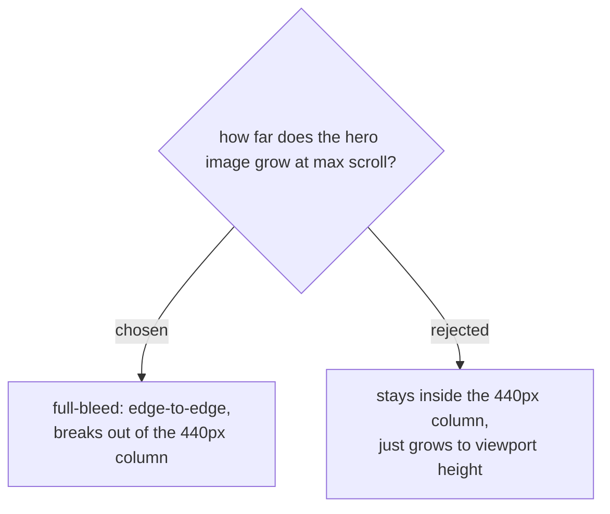

# Hero banner breaks out to true full-bleed on scroll

The picker screen (and every other screen — ask/lookup/pass) is built on a
centered `.screen-inner{max-width:440px}` column. The new scroll-reveal hero
banner is the first element allowed to break out of that column at full
scroll, rather than staying framed inside it. Chosen because the user's own
framing was "เต็มจอ" (fills the screen) taken literally, and a true full-bleed
image reads as more cinematic/dramatic than one that's merely tall but still
framed — which is the effect being asked for.
