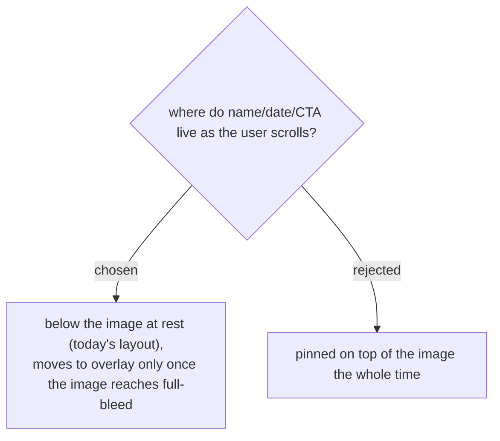

# Event info and CTA start below the image, move to overlay only at full expansion

Keeps the initial view identical to what's already shipped (image card, info
block underneath) so the change is additive rather than a rewrite of the
at-rest state. The move-to-overlay only triggers at the fully-expanded
end of the scroll range, matching the user's own framing: "ถ้าเลื่อนจนสุด...
ข้อมูลและปุ่มจะอยู่ด้านหน้า Banner" describes the fully-scrolled state
specifically, not the resting state.
