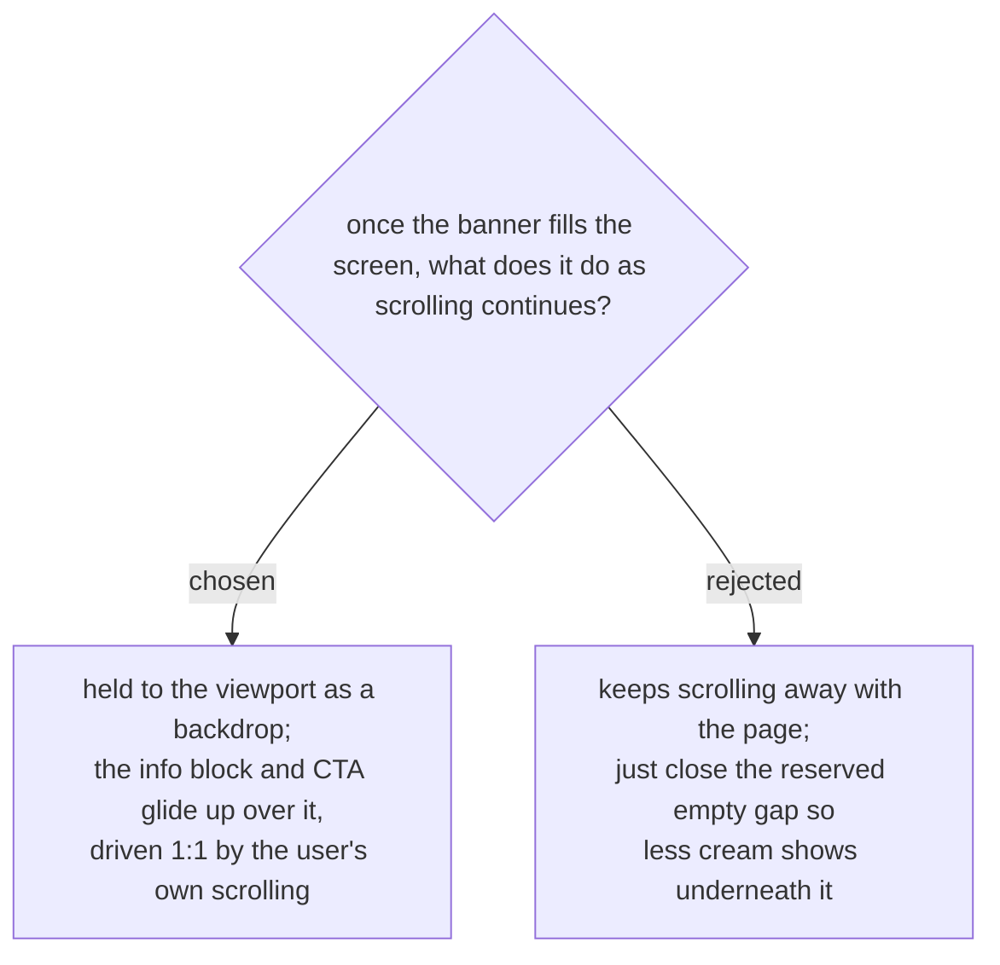

# The banner is held to the viewport as a backdrop while the info scrolls over it

Supersedes the "no pinning" half of events-checkin-0003. That ADR rejected
holding the *screen* still — scroll-jacking, where the user's finger moves
and the page does not. This decision does not reintroduce that: scrolling
stays 1:1 with the page for the whole interaction. What is held is the
banner alone, as a backdrop, while the content in front of it moves with
the scroll.

The pass-through mechanism as shipped let the banner drift upward out of
the viewport once it reached full size, leaving 420px of background visible
underneath it at the end of the scroll (372px of which was space the layout
reserved and never filled). The user's framing — "Banner ต้องไม่ลอยขึ้นเห็นพื้น
Background" — rules that out directly, and holding the banner is the only
way a growing element can stay aligned to the viewport.

The rest state (small centred card, info below it) is unchanged, and the
gradual expansion is unchanged: "Banner จากจุดเริ่มต้นถูกแล้ว ... แต่ยังคง Motion
ค่อย ๆ ขยายเหมือนเดิม".
