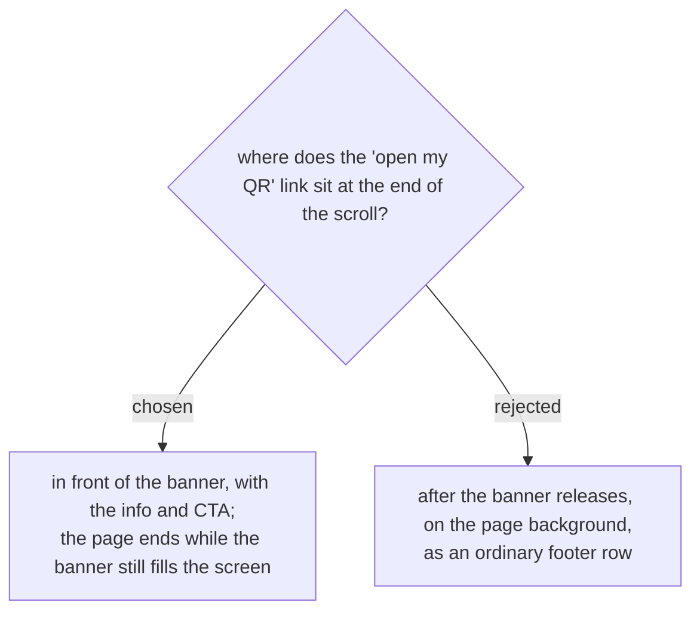

# The picker page ends on the full-screen banner, with every element in front of it

Follows events-checkin-0004 to its conclusion: if the banner is held so the
background never shows underneath it, then a footer row rendered on that
background would reintroduce exactly what the user rejected — just at the
very end instead of the middle. The lookup link joins the info block and CTA
as content layered in front of the banner, and the page's last scroll
position still shows a full-screen image.

Cost: the lookup link needs a light treatment for legibility on a photo,
the same way the info block already switches to white. It cannot keep the
muted grey-on-cream styling it has today.
