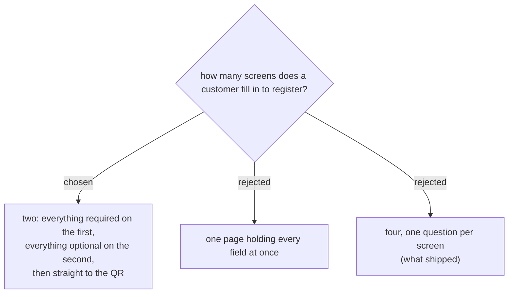

# Registration is two pages split by required vs optional, not one question per screen

The shipped flow asks one question per screen — name, email, phone, then
organisation with the PDPA consent box — so a customer taps "next" four
times to hand over four values. The user's reading of it was blunt:
"หลายขั้นตอนเกิน ดูน่ารำคาญสำหรับลูกค้า".

A single page holding all four was the obvious fix and was rejected in
favour of two. The split carries information a flat list cannot: the first
page is what the customer *must* give to get in, the second is what they
*may* give. That tells them where the finish line is, and lets the optional
half be skipped as a unit rather than field by field.

The QR follows immediately after the second page — no summary or review
step in between.

Which fields land on which page is decided separately.
