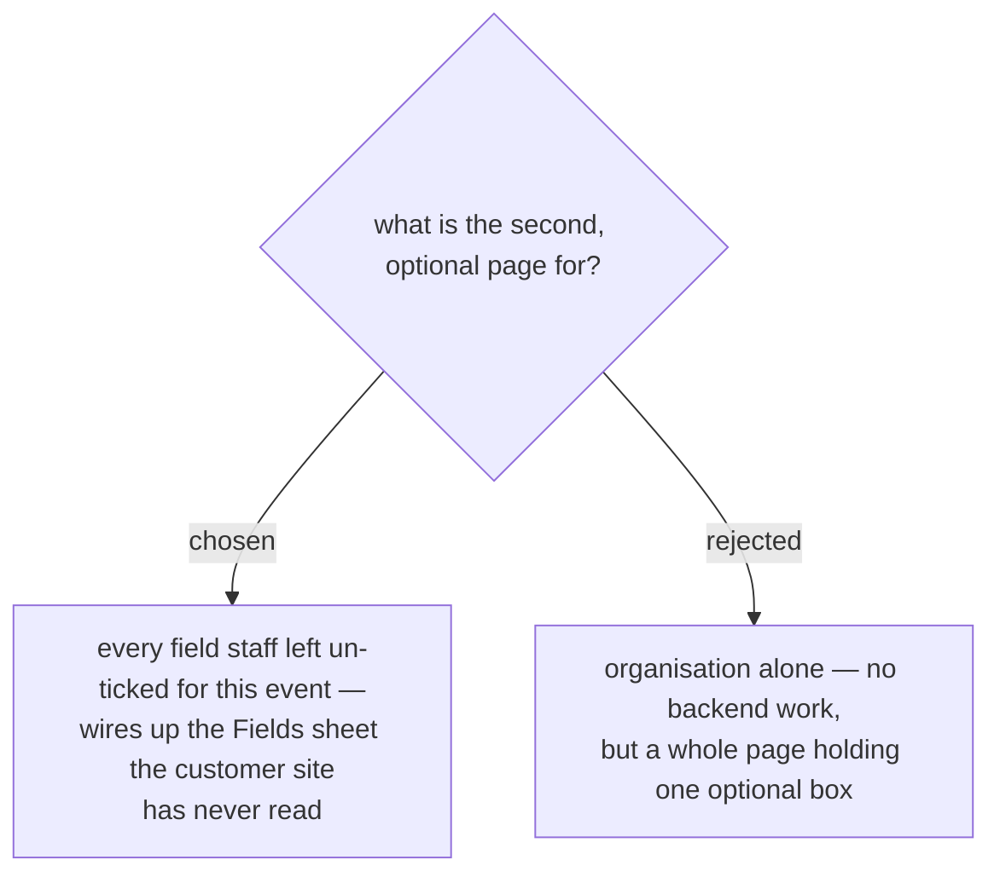

# The optional page carries the event's own questions, not just a spare field

Splitting registration into a required page and an optional one
(events-checkin-0006) left the optional page holding a single field, which
is too thin to justify a page of its own. Rather than fold it back into one
page, both pages are driven by the event's own field list.

The capability already exists on the back end and has simply never been
reachable from the customer site — the Staff Console's own field editor
says so on screen: *"ตอนนี้บันทึกลงชีตแล้ว แต่หน้าลูกค้ายังใช้ฟอร์ม 5 ขั้นแบบตายตัวอยู่
จะเชื่อมให้ฟอร์มลูกค้าอ่านฟิลด์ชุดนี้จริงในขั้นถัดไป"*.

- `Fields` (one sheet per event) holds `key, label, type, required,
  sort_order`, seeded with `name`, `email` and `phone`.
- `getEventForm(eventId)` is public and returns that list, sorted.
- `Registrations` already carries an `answers_json` column.
- Staff can toggle any field between จำเป็น and ไม่บังคับ
  (`staff/staff.js:605`, flipped at `:997`); newly added fields start
  ไม่บังคับ.

**The page split is exactly the `required` column** — ticked rows make the
first page, un-ticked rows the second. No key is special-cased, and a
question staff add later lands on the right page on its own. The live `tt`
event already carries a fourth row (`org` / บริษัท / องค์กร / TEXT /
ไม่บังคับ), so organisation is not a hardcoded client extra: the whole form
is already describable by `getEventForm`.

One constraint the field editor does impose: it offers no control for
`type`, so every staff-added question is written as `TEXT`. Only the three
seeded rows carry `EMAIL` and `PHONE`. Custom questions are therefore plain
text boxes, and a required one validates as "not empty" and nothing more.

Cost, accepted knowingly: this is the first change in this effort to touch
the back end. `register()` writes `answers_json` as a placeholder
(`JSON.stringify({ org: org })`) and ignores anything else the client
sends, so it has to accept and store the extra answers, and both Apps
Script deployments have to be redeployed.
