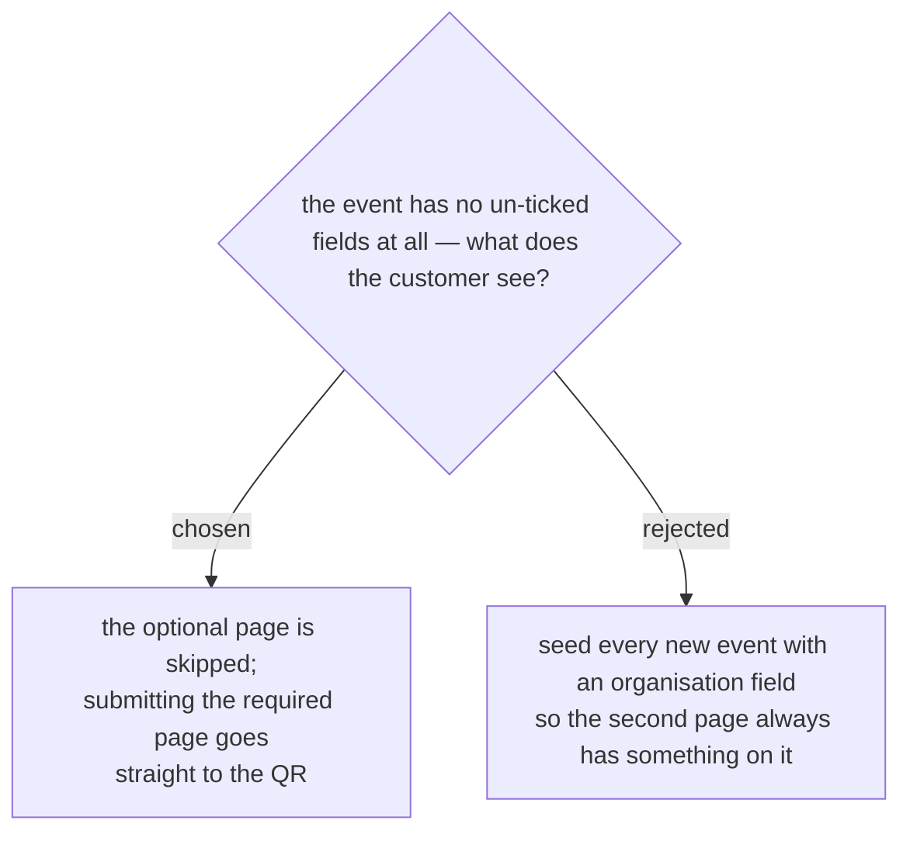

# An event with no optional fields sends the customer straight to the QR

`svcCreateEvent_` builds a new event's Fields sheet with the three seeded
rows only (`createEventFile_(id, name)` — no `extraFields`), all of them
required. A newly created event therefore has nothing optional to ask, and
a second page would render empty.

Rather than pad the form with a field nobody asked for, the page count
follows the event: one page when there is nothing optional to collect, two
when there is. The user set the rule directly — *"หากไม่มีข้อมูลไม่บังคับเลย
ให้ข้ามไปที่หน้า QR เลย"*.

The trade is that the number of pages differs between events, so the flow
is not identical for every attendee. That is accepted: a page that exists
only to be skipped is worse than a page count that varies, and the effort
started from the complaint that there were too many steps.
