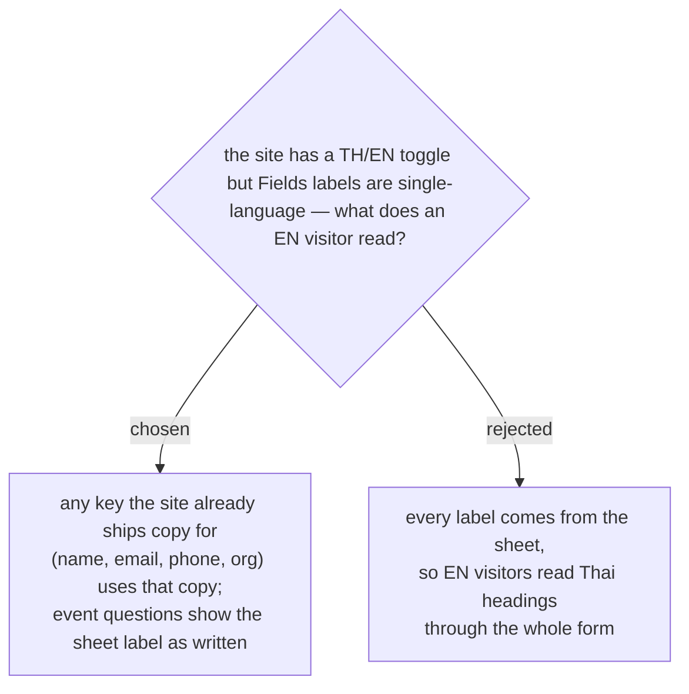

# Labels come from built-in copy where the site has it, from the sheet otherwise

The customer site ships TH and EN copy for the four questions it has always
asked and a toggle between them. The `Fields` sheet has one `label` per row
and no language column, so rendering labels straight from it would regress
the English form to Thai headings — including for fields every event has.

Matching a field's key against the site's own copy keeps that translation
working, at no cost to staff. The set is the four keys the site already
covers — `name`, `email`, `phone` and `org` — not just the three seeded into
new events, because `COPY.en` carries wording for all four
(`Full name`, `Your email`, `Contact number`, `Company or organisation`).
Anything else has no translation to fall back on and shows exactly what
staff typed.

One thing the existing copy does *not* supply: the current entries are
questions posed one per screen (`"คุณชื่อ\nอะไร?"`, `"What's\nyour name?"`) plus a
placeholder, which is the wrong shape for a compact labelled form. Short
labels are new copy that has to be written for both languages; the existing
question wording moves up to become the page's own heading.

The trade: an English-speaking attendee sees translated core questions and
then a Thai event question below them. Adding a second label column to the
sheet and a place to type it in the Staff Console would fix that, and is
deliberately not in this change — the effort is about cutting steps, not
about building translation tooling.
