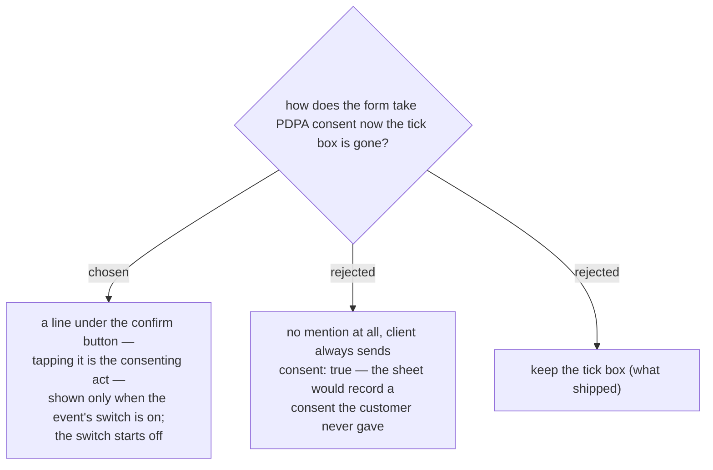

# PDPA consent becomes a notice under the button, behind a per-event switch that starts off

The tick box costs a tap and the user asked for it gone. Dropping the
consenting act entirely was rejected: `register()` refuses a registration
without `consent` (`consent_required`) and stamps `consent_at` into the
Registrations row, so a client that always sent `consent: true` would be
writing a consent record for something the customer never did.

Moving the wording under the confirm button keeps the record truthful — the
customer performs an affirmative act, having been shown the terms next to
it — and still removes the extra tap.

**The switch.** The notice is not wanted live yet, so it sits behind a
per-event toggle in the Staff Console, defaulting to off. Per-event rather
than system-wide because every other switch here already is (`open`,
`hidden`), and there is no system-wide settings store to add one to.

Mechanically this follows the path `hidden` and `image_url` already took:

- a `pdpa` column appended to `EVENTS_HEADERS`; `migrateHeaders_` adds it to
  the existing sheet, and existing rows get an empty cell, which reads
  falsy — so every event starts with the notice off, as asked.
- `svcSetEventProp_` accepts `p.pdpa` alongside `p.open` and `p.hidden`.
- `listEvents` carries the flag to the customer site, which shows the line
  only when it is on.
- `register()` demands `consent` only for an event whose flag is on. With
  the switch off, `consent_at` stays empty rather than recording a consent
  that never happened — which is the whole point of not faking it.

Deployment note: `migrateHeaders_` runs from `setupSheets()`, so that has to
be run once after the deploy or `svcSetEventProp_` will look for a `pdpa`
column that is not there yet.
