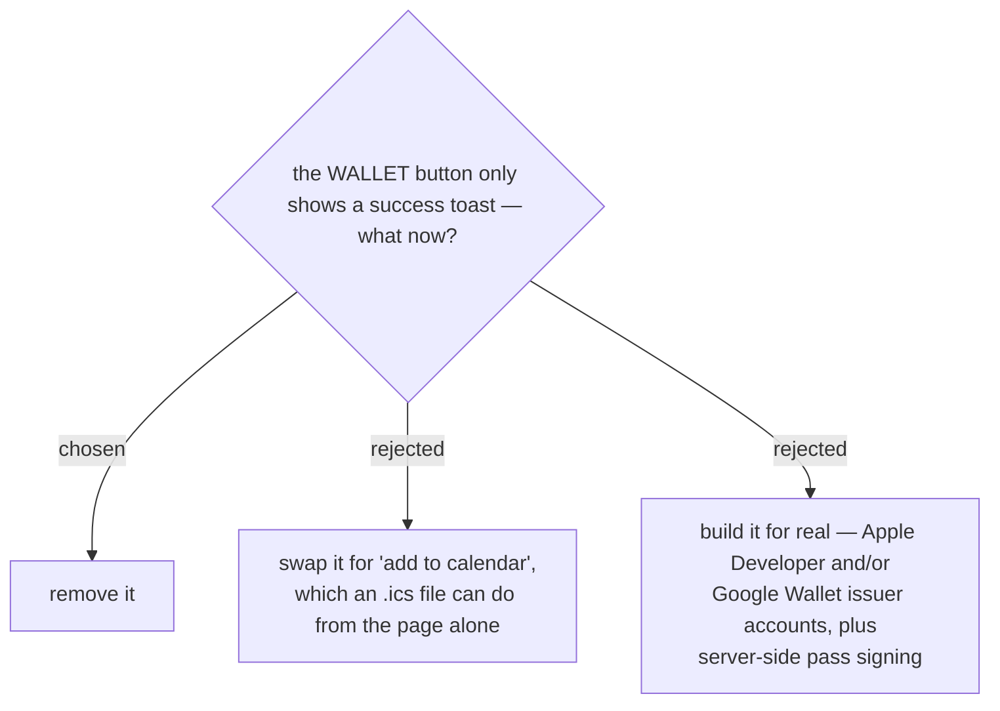

# The Wallet button is removed rather than implemented



The pass screen carries two buttons whose handlers do nothing but flash a
success message:

```js
case "save-img":   flash(t().toastImg);    break;   // "บันทึกรูป QR ลงเครื่องแล้ว"
case "add-wallet": flash(t().toastWallet); break;   // "เพิ่มบัตรใน Wallet แล้ว"
```

Nothing is written and no pass is created — `qr.js` exports only
`renderQrSvg`, and there is no download or signing code anywhere in the
customer site. A customer taps, is told it worked, and arrives at the door
with nothing saved. That is worse than having no button at all, which is
why this is being resolved now rather than left for later.

A real Wallet pass needs an Apple Developer account and/or a Google Wallet
issuer account plus certificate-signed passes generated server-side — a
project of its own, and out of proportion to an effort whose point was to
cut steps out of a form. Rather than leave a button that lies, it goes.

The save-image button stays and gets a real implementation; that is decided
separately.
