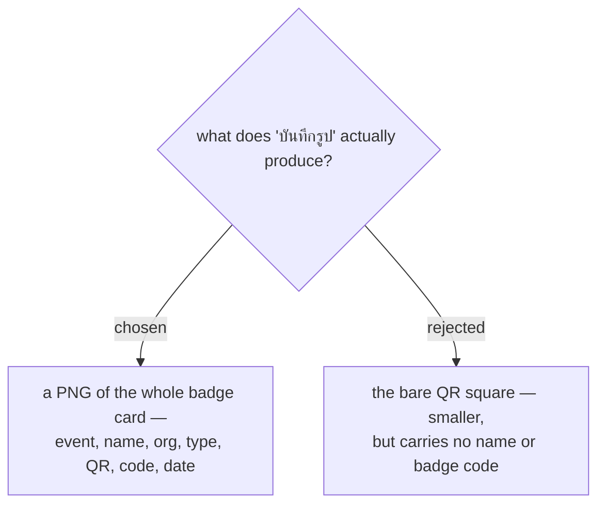

# Save-image writes the whole badge, drawn on a canvas, and only says so when it worked

The button currently flashes "บันทึกรูป QR ลงเครื่องแล้ว" and saves nothing
(see events-checkin-0011). It stays, and starts doing what it says.

**The whole card, not the QR alone.** If a scanner cannot read the screen at
the door — cracked glass, dimmed display, harsh sun — staff fall back to
looking the attendee up by badge code or name. A bare QR image carries
neither. The card already holds everything: `ENTRY PASS · <event>`, name,
org, type, the QR, the badge code and the date.

**Drawn on a canvas, not rasterised from the DOM.** Turning styled HTML into
an image needs a library (html2canvas) or an SVG `foreignObject` round-trip
that silently drops web fonts. Instead the badge is drawn directly with the
Canvas 2D API: the vendored `qrcode` library already exposes
`getModuleCount()` and `isDark(r, c)` (see `qr.js`), so the QR is a loop of
filled squares, and the text is `fillText` in Prompt, which the canvas can
use because the page has already loaded it — awaited via `document.fonts.ready`.
No new dependency.

**Delivery, and the honest toast.** iOS Safari blocks programmatic
`<a download>` clicks, which is the trap that would make this button lie a
second time. So: `navigator.share({ files: [png] })` where available — the
native sheet on iOS and Android offers Save to Photos — falling back to an
`<a download>` click elsewhere, and to showing the PNG inline for a
press-and-hold save if neither path is available. The success toast fires
only after a save path actually reports success, never on the tap.
