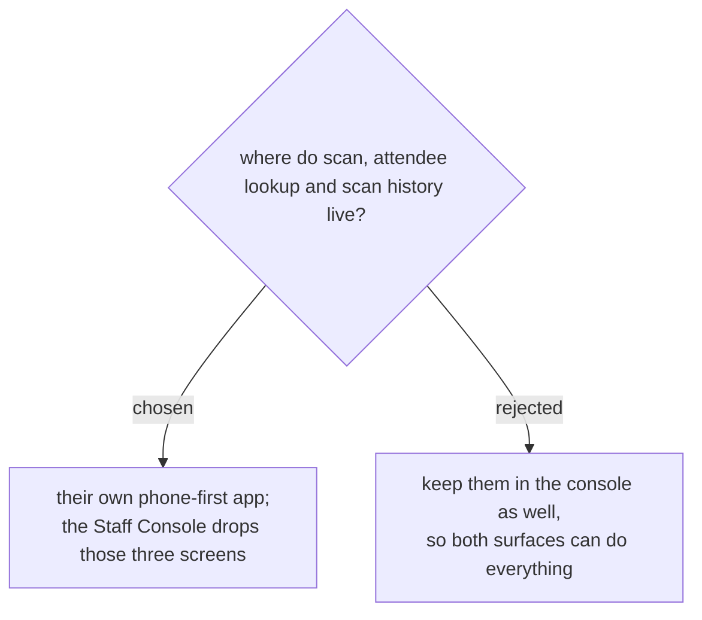

# The door tools move to their own app; the console keeps the desk work

The Staff Console is a desktop tool, and its scan screen renders a *drawing*
of a phone inside a wide two-column layout. Opened on an actual phone — which
is what the person on the door is holding — the result is measured at
390×760:

| | y |
|---|---|
| bottom of the screen | 760 |
| camera starts at | 684 (only 76px of it visible) |
| scan result card at | 1201 — **441px below the fold** |

So the person scanning cannot see whether the scan worked without scrolling
after every badge. The status is not missing, as first suspected; it is
rendered somewhere nobody can look while holding a phone at a queue. A beep
distinguishes success from failure, which a noisy hall takes away too.

Rather than bolt a mobile layout onto a desktop console, the three things
the door actually needs — scan, look someone up by name, see what has been
scanned — become their own app, built for a phone held one-handed.

**Only scanning leaves the console.** The first draft of this decision had the
console dropping all three screens. That was written without looking at what
the attendee screen carries: walk-in registration, changing a pass type,
manual check-in, deleting an attendee and the CSV export all hang off it, and
an ADMIN sees the email and phone a STAFF caller never receives. Those are
desk jobs; moving them to a phone at a door would be worse for everyone.

So the split is by shape, not by subject:

| | console | gate app |
|---|---|---|
| scan | removed | the whole point of it |
| attendees | kept — manage, export, full contact details | search and check in, no PII |
| history | kept — the audit surface, on a big screen | a short "just scanned" strip |

Scanning is the one that genuinely has to go: it is measurably bad there, and
two scanners is how people end up using the worse one without knowing which
they used when they report a problem. The other two are not duplicates — they
are different tools over the same data, and the API already hands each caller
a different amount of it.

Same database, same backend, same Google sign-in: this is a second front end
over the existing API, not a second system.

Cost, accepted: two front ends to keep in step, and anyone used to scanning
from the console has to switch.

**Sequencing.** The console keeps its three screens until the gate app has
carried one real event, then loses them. Removing them on the day the new app
ships would leave a door with no way to check anyone in if the app meets
something the testing did not — a phone whose camera it cannot open, a token
that expires mid-event. Running both is a known cost, deliberately paid once:
a second, worse scanner is how people end up using the worse one, so this is
an overlap with an end, not a permanent pair.
