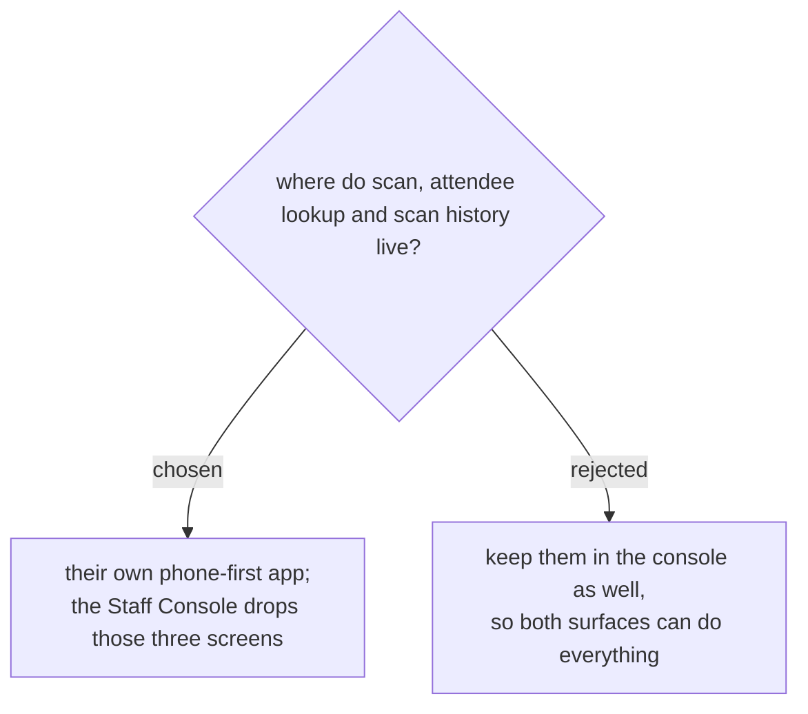

# The door tools move to their own app; the console keeps the desk work

The Staff Console is a desktop tool, and its scan screen renders a *drawing*
of a phone inside a wide two-column layout. Opened on an actual phone — which
is what the person on the door is holding — the result is measured at
390×760:

| | y |
|---|---|
| bottom of the screen | 760 |
| camera starts at | 684 (only 76px of it visible) |
| scan result card at | 1201 — **441px below the fold** |

So the person scanning cannot see whether the scan worked without scrolling
after every badge. The status is not missing, as first suspected; it is
rendered somewhere nobody can look while holding a phone at a queue. A beep
distinguishes success from failure, which a noisy hall takes away too.

Rather than bolt a mobile layout onto a desktop console, the three things
the door actually needs — scan, look someone up by name, see what has been
scanned — become their own app, built for a phone held one-handed. The
console keeps what a desk does: overview, fields, badge design, team.

Same database, same backend, same Google sign-in: this is a second front end
over the existing API, not a second system.

Cost, accepted: two front ends to keep in step, and anyone used to scanning
from the console has to switch. The console will not keep a copy of these
screens — a second, worse scanner is how people end up using the worse one.
