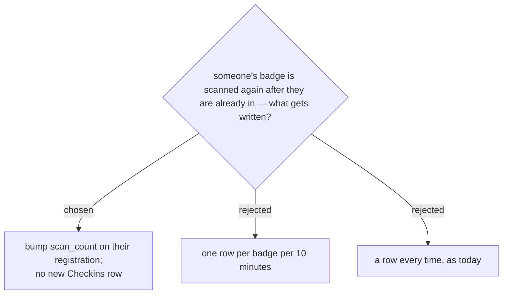

# A repeat scan bumps a counter instead of writing another log row

`logScan_` currently appends a Checkins row for every scan, including
repeats and rejections.

The reason to change it is **not** storage, which was the first suspicion.
Checkins is 11 columns and lives in each event's own spreadsheet file, so
Google Sheets' 10-million-cell ceiling leaves room for roughly 900,000 rows
per event — a 240-seat event could not fill it by accident.

The reason is **time at the door**. Every row is an `appendRow` to Google
Sheets performed while holding a script-wide `LockService` lock, so a repeat
scan costs a queue exactly as much as a real check-in does. Removing that
write removes the cost.

What is given up: the log will no longer say when each repeat happened or
who was scanning at the time, so "I was turned away at 09:15" can no longer
be reconstructed from it. The registration row still carries `scan_count`
and the original check-in's time, gate and operator, which covers the
question that gets asked most — *is this person already in, and who let them
in* — and that is judged enough.

Rejections (wrong event, bad signature, unknown code) still write a row.
Those are the ones worth being able to look back at, and they are rare.
