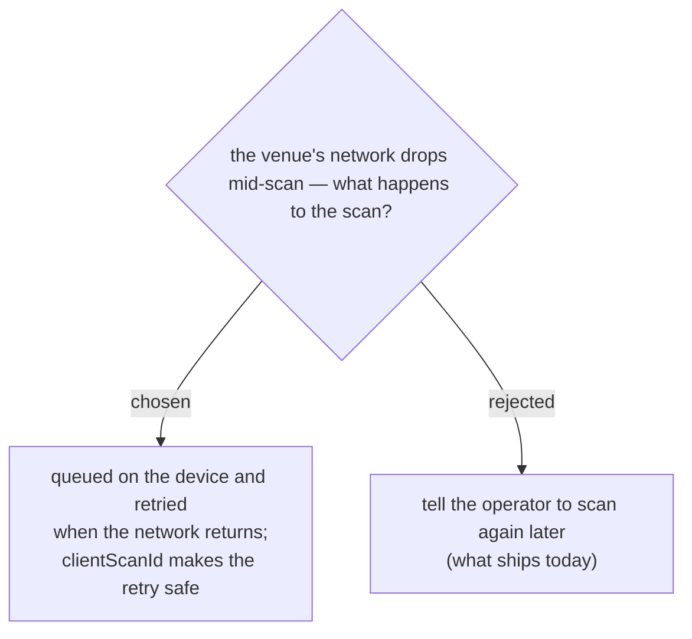

> **Superseded by events-checkin-0017.** Written before it was established
> that the QR signature can only be verified server-side, so an offline
> queue means admitting people on unverified badges. The gate app blocks
> check-in while offline instead, and there is no queue.

# Scans survive the network: queued on the device, sent when it returns

Today a scan that fails to reach the server is gone. The scanner now says so
rather than dying silently, but the person is still not checked in and
nobody finds out until they are turned away at the door.

Scans go into a queue on the device instead, drain when connectivity comes
back, and the operator sees how many are still waiting. A hall with patchy
wifi stops costing attendees their entry.

This finally uses `clientScanId`, which the client has been generating and
sending since the beginning and the server has only ever written to the log.
A retry carries the same id, so the server can recognise a scan it has
already applied and return the original outcome instead of processing it
twice. Without that, the queue would be the thing that creates double
check-ins rather than the thing that prevents lost ones — which is why these
two were decided together.
