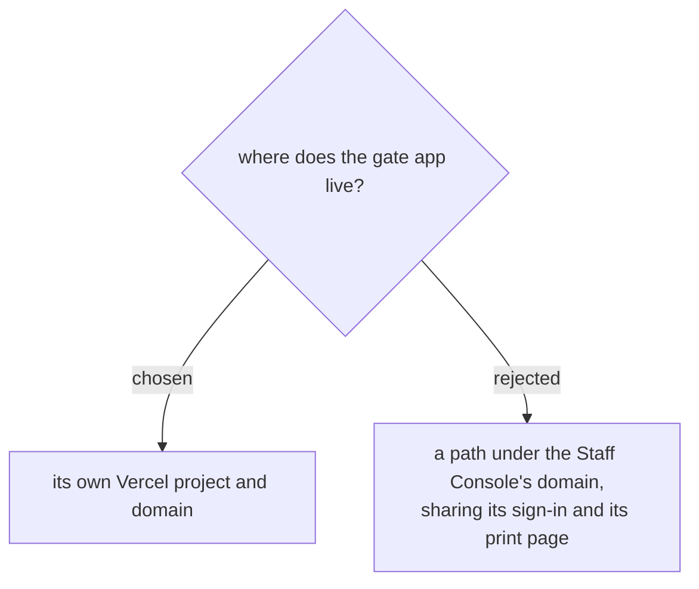

# The gate app gets its own domain, and takes the badge print page with it

A clean separation was preferred over sharing the console's origin. Two
consequences follow directly and are accepted rather than discovered later:

**Signing in twice.** The Google ID token is kept in `localStorage`, which is
per-origin. Someone who uses both the console and the gate app signs into
each. For the people this app is built for that is a non-issue — door staff
open the gate app and nothing else — but an admin moving between the two
will notice.

**The badge print page moves.** `staff/badge.html` was just rewritten to read
that same token from the console's origin, which is exactly why it works for
every staff member now (events-checkin-0011/0012 replaced an Apps Script page
that only ever worked for the script owner). From a different origin it would
be back to "ยังไม่ได้เข้าสู่ระบบ". So the page moves to the gate app, which is
also where the only remaining reason to print sits: the console is losing the
scan and attendee screens (events-checkin-0013), and its badge screen designs
badges rather than printing one for a person.

Nothing changes on the back end. Both front ends call the same `staffCall`
endpoint with the same verified token, and `requireStaff_` decides what each
caller may do — the split is in the front end only.
