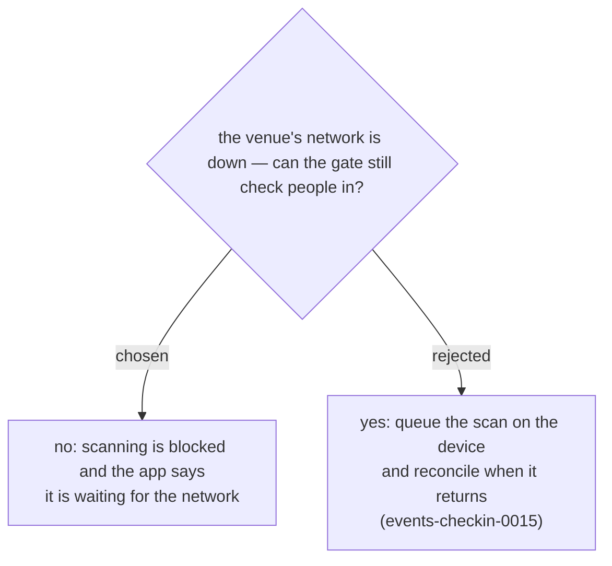

# Offline stops the door rather than admitting people unverified

Supersedes events-checkin-0015, which was decided before this was on the
table: **a badge's signature can only be checked on the server.** `signQr_`
reads `QR_SECRET` from Script Properties, so the app has no way to tell a
real QR from a forged one on its own — offline it can confirm the shape
`event|badge|signature` and nothing more.

An offline queue therefore does not mean "check people in and sync later".
It means admitting people on badges nobody has verified, and finding out
hours later, once they are inside, that one of them did not hold a real
one. Given the choice between a door that pauses and a door that cannot
say who it let in, the pause wins.

So while the app cannot reach the server it shows that it is waiting and
does not scan. Consequences accepted:

- **A network outage stops admissions**, it does not merely slow them. The
  network at the venue is now a hard dependency of the door, which makes
  testing it before doors open part of the job rather than a nicety.
- **`clientScanId` loses its purpose.** It existed to make a retried scan
  safe; with nothing retried, nothing needs deduplicating. It stays in the
  payload and the log, unused, rather than being ripped out of a schema for
  no gain.

"Offline" is decided by whether requests are actually succeeding, not by
`navigator.onLine` — a phone joined to a venue's wifi that has lost its
uplink reports itself online, which is precisely the situation this has to
catch.
