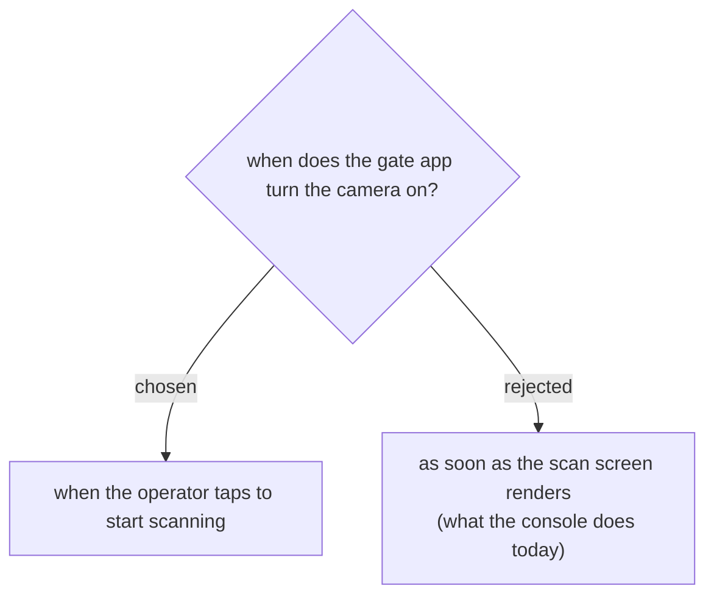

# The camera opens when someone asks for it, not when the screen loads

The console calls `mountCamera()` from `render()` whenever the scan screen is
showing, so opening the screen opens the camera — and every re-render while
scanning keeps it open. The gate app waits for a tap instead.

Three reasons, in the order they matter at a real door:

- **The permission prompt lands where it makes sense.** Opening the app fires
  the browser's camera request before the operator has done anything, which
  reads as the app grabbing for something. After a deliberate "start
  scanning" it reads as the answer to what they just asked for — and someone
  who declines it by reflex at launch has to go into browser settings to
  undo that.
- **A phone at a door runs all day.** A camera held open through breaks, queue
  lulls and the time spent on the attendee list is battery spent on nothing.
- **A visibly-off camera is worth something to the people being scanned.**
  A phone pointed at a queue with the lens live and nobody looking at it is
  not a good look, whatever it is actually doing.

Stopping is the same gesture in reverse: leaving the scan tab releases the
stream, and coming back asks again. The manual code entry stays available
with the camera off, so a device that cannot open a camera at all — or an
operator who declined the prompt — can still work the door.
