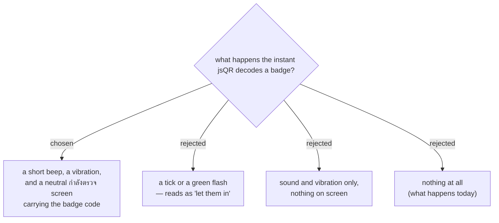

# The moment a QR is read gets its own signal, and it does not look like approval

A check-in takes about five seconds, measured on the live backend: 5.3s median
across 115 scans through five gates, and 5.6s with a single gate and nothing to
queue behind. About 2.5s of that is Apps Script overhead before any of our code
runs — a bare public `listEvents` costs the same — and about 1.4s is opening
the per-event spreadsheet. It is not going away.

For all five of those seconds the gate app currently shows **nothing**.
`submitScan()` sets `state.busy = true` and never calls `render()`, so from the
instant the camera reads the code until the verdict lands, the screen is
unchanged. The operator has no way to tell a successful read from a camera that
never focused, so they keep the phone held at the QR — which is exactly what
was reported.

So the read gets its own signal, separate from the verdict:

| | what the operator gets | what it means |
|---|---|---|
| the instant the code is decoded | short beep · vibration · neutral screen with the badge code | *we have it — you can lower the phone* |
| about five seconds later | the full-screen verdict, green / gold / red / blue | *this is what to do about this person* |

**The first signal must not resemble the second.** At the moment of decoding,
the app knows only that it read a code — not whether the badge is real, not
whether it belongs to this event, not whether the person is already inside. A
tick or a green flash there would be read as "let them in", and staff would
start waving people through on it. A forged badge decodes perfectly; it is the
server, five seconds later, that refuses it.

So the receipt is deliberately colourless: no tick, no green, no verdict
vocabulary. It says the code was captured and that checking is under way, and
it shows the badge code so the operator can see *which* badge was captured.

Sound and vibration are there because they cost the operator no attention — a
door is loud and busy and the phone is often not being looked at. They are not
sufficient on their own: a hall can be loud enough to swallow the beep, and a
phone held in the hand does not always carry a vibration convincingly. The
screen is the signal that always survives; the sound and the buzz are what make
it arrive without looking.
