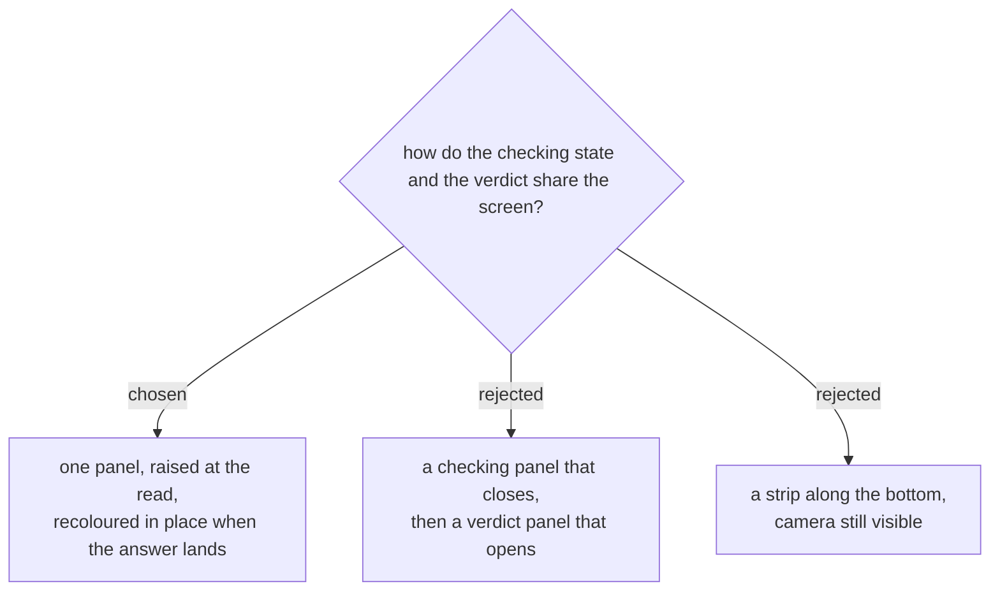

# One panel that changes colour, not two panels that take turns

The verdict is already a full-screen panel (ADR 0013's whole reason for
existing: the console put the result 441px below the fold). Adding a second
full-screen panel in front of it would mean the screen is taken over twice per
person — raised, dropped, raised again — roughly eighty times across a queue of
forty at one gate.

So there is one panel with two phases. It goes up the instant the code is
decoded, in a neutral colour carrying the badge code and *กำลังตรวจ*. About
five seconds later the same panel becomes green, gold, red or blue in place:
the colour changes, the words change, the buttons appear. Nothing closes and
reopens.

This reads correctly as well as looking calmer. One person presenting one badge
is **one event with two phases**, not two events. The panel going up means
"this badge is being dealt with"; its colour means "and here is the answer".

A strip along the bottom with the camera still live was rejected for the reason
the whole app exists: something small at the edge of a screen, at a loud door,
with the phone half-lowered, is close enough to nothing. And it would buy
nothing in exchange — `submitScan()` refuses a second badge while `state.busy`
is set, so a live camera during those five seconds cannot scan anybody anyway.
It would only look like it could.

The panel keeps the behaviour the verdicts already have: `ok` clears itself
after 1.9s, everything else waits to be dismissed. The neutral phase never
clears itself, because it is not a result — it ends only when the answer
replaces it, or when the deadline turns it into one.

Supersedes nothing; extends [[events-checkin-0019]], which decided that the
read gets a signal of its own and that it must not look like approval.
