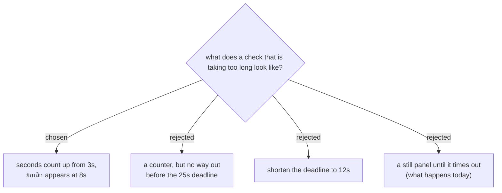

# A slow check counts up, and can be abandoned

Measured on the live backend today: a check-in takes about 5s normally and 9.6s
at its worst across 115 scans. But Apps Script itself stalled twice during the
same session — 38s and 48s — and answered with an HTML error page rather than
JSON. The gate app gives up at 25s.

So a stall is not hypothetical, and the shape of it is: *nothing moves for
almost half a minute while a queue watches*. A still panel through that is
indistinguishable from a frozen app, and an operator who believes the app has
frozen will start pressing things, restart it, or wave people through.

Three seconds in, the panel starts counting the seconds. It is the cheapest
possible proof that the app is alive and still waiting on somebody else — and
under normal conditions it never appears at all, because the answer lands at
about five seconds and the counter has barely started.

Eight seconds in — comfortably past the worst honest response measured — a
**ยกเลิก** button appears. Two things it deliberately does not claim:

- **It does not undo anything.** The request may already have reached the
  server and checked the person in; a client cannot take that back. The button
  abandons *waiting*, not the check-in.
- **It is therefore safe to press.** Cancel, present the badge again, and the
  answer tells the operator what actually happened: gold means the first
  attempt did land, green means it did not. Either way the door learns the
  truth from the server rather than guessing.

Because the point of cancelling is to try again, cancelling clears `lastCode`,
so the same badge held in the same hand can be read immediately. This is the
opposite of what the 25s deadline does — a timeout leaves `lastCode` set on
purpose, so a badge still sitting in frame does not silently re-send itself
with nobody asking. A timeout is the app giving up unasked; a cancel is a
person asking for another go. They should not behave the same way.

The deadline stays at 25s. Cutting it to 12s would have declared failure on
work that was still going to succeed — the measured stalls were 38s and 48s,
and an event where the backend is that slow is one where a shorter deadline
just turns slow scans into refused ones.

Extends [[events-checkin-0020]]: this all happens inside the same single panel,
in its neutral phase.
