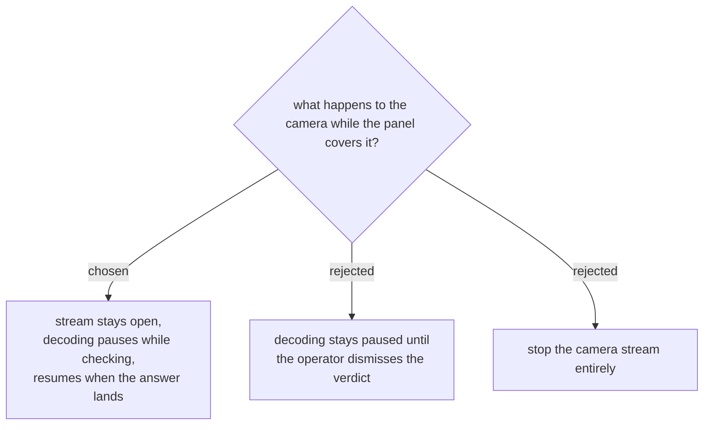

# Pause the reading, not the camera

Three different things get confused as "turn the camera off": releasing the
stream, showing something over it, and running jsQR on its frames. Only the
last one matters here.

**Releasing the stream is out.** `getUserMedia` costs one to two seconds to
come back, and this would happen for every single person — turning a five
second cycle into seven. The camera stays open for the whole shift, exactly as
ADR 0018 set up: it opens when the operator asks and closes when they leave the
tab.

**Decoding pauses while the check is in flight.** Today the `tick()` loop keeps
running jsQR over every frame for the whole five seconds and `submitScan()`
simply refuses what it finds, so the work is done and thrown away. On a phone
running a door all day that is real battery spent on nothing. The loop stops
when the panel goes up and starts again when the answer lands.

**Reading resumes the moment the answer arrives**, not when the operator
dismisses the panel. The queue keeps moving: the next badge can be presented
while the current verdict is still on screen.

## The risk this leaves open, accepted deliberately

`ok` clears itself after 1.9s, but `duplicate` and the refusals stay up until
somebody taps them. So a badge can be read *through* an undismissed rejection.

The scenario, raised before the choice was made and accepted anyway: person A's
badge is refused and the panel goes red. The operator turns to explain. Person
B, standing close, still has their phone up. The camera reads B's badge through
the red panel and five seconds later the panel is green with B's name on it.
The operator looks back, sees green, and lets A in — and nothing on screen ever
shows that a rejection happened.

The alternative — keep decoding paused until the verdict is dismissed — closes
this completely and costs throughput on every person to do it. That trade was
put plainly and the faster side was chosen. What follows from it is
[[events-checkin-0023]], which keeps the rejection on screen without giving the
throughput back.
