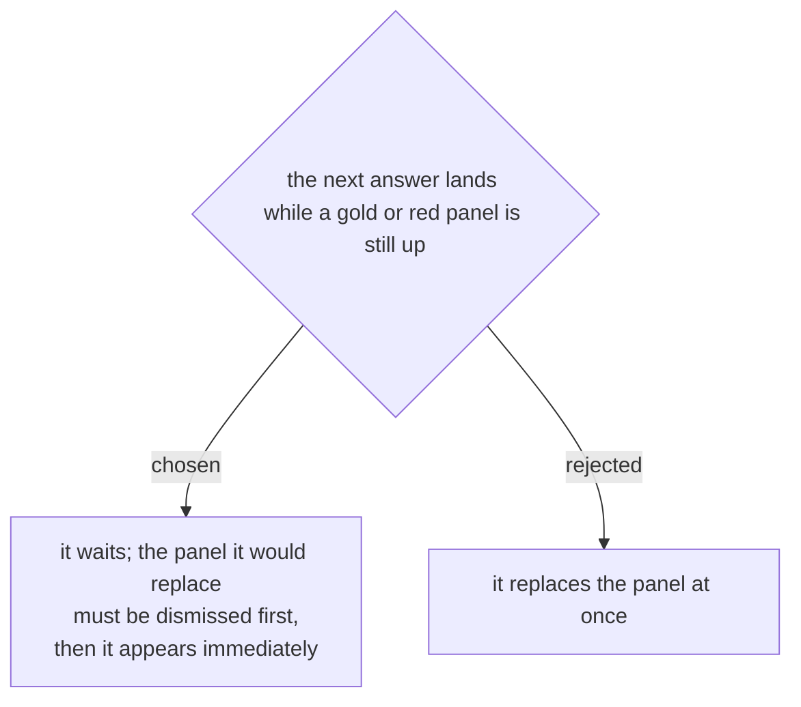

# A verdict that needs acknowledging is never overwritten by the next one

[[events-checkin-0022]] let reading resume the moment an answer lands rather
than when the operator dismisses it, so the queue keeps moving. That left a way
for a refusal to disappear before anybody saw it: person A is refused, the
operator turns to explain, person B's badge is read through the red panel, and
five seconds later the panel is green with B's name on it.

So the answer waits for the panel, not the other way round.

Nothing about the scan itself changes. The badge is still read at the same
moment, still sent at the same moment, and the check-in is still recorded on
the server at the same moment — person B is inside the system whether or not
their verdict is on screen yet. What waits is only the *display*. Throughput is
untouched, because throughput was never a function of when a panel was painted.

What it buys is that a refusal cannot be silently replaced. The operator has to
dismiss it, which at a door is the thing they should be doing anyway: deal with
this person, then look at the next one.

Scope, so this does not become a queue nobody can clear:

- **Only `duplicate` and the refusals hold the screen.** `ok` clears itself
  after 1.9s, so a green almost never delays anything; by the time the next
  answer arrives the screen is free.
- **One deep.** A newer answer replaces an older *waiting* answer rather than
  stacking behind it. Nobody at a door wants to tap through four stale verdicts
  to reach the person in front of them, and the older one has already been
  recorded and is visible in เพิ่งสแกน.
- **The neutral checking phase never waits.** It is not a result and blocks
  nothing; it goes up the instant a code is read, which is the whole point of
  [[events-checkin-0019]].
