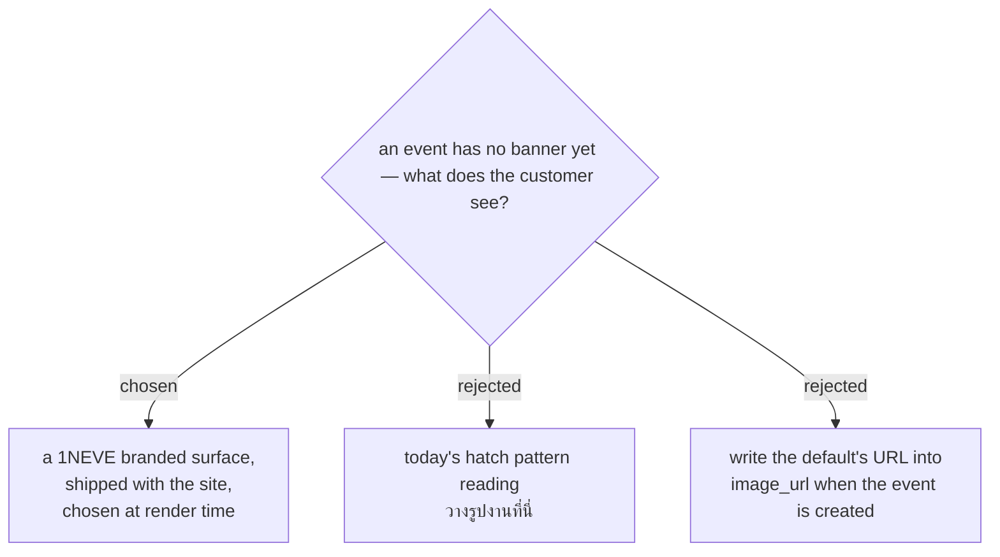

# An event with no banner shows a branded surface, not a missing image

Today an event with a blank `image_url` renders `.img-placeholder`: a diagonal
hatch swatch with **วางรูปงานที่นี่** across the middle. It is the worst of
both worlds. It looks like a broken image to a customer, and it invites a
staff member to drop a file on something that has never been able to receive
one — the same class of lie this project has spent the week removing from the
gate app.

So a bare event gets a designed surface instead. A customer who lands on an
event whose photo has not arrived yet sees a 1NEVE card, not a fault.

**Confirmed against a rendered mockup**, built from the customer site's own
tokens and shown with the real overlay copy and the real scrim:

**https://claude.ai/code/artifact/4e9f0c16-8612-4262-b690-c70e489429af**

Three surfaces were drawn. The chosen one is **C — ไล่เฉดแบรนด์**: the brand
orange falling diagonally into the ink, with a large 1NEVE monogram ghosted
behind it at low opacity. A quiet sandstone (A) and a refined version of
today's diagonal hatch (B) were rejected — A because every event would look
identical, B because it still reads as *รูปหาย*, which is the one thing this
ADR exists to stop.

The mockup surfaced a constraint that words had hidden: the hero's scrim runs
from `rgba(19,17,12,.88)` at the bottom to transparent at the top, and
`.hero-topshade` darkens the top 120px for the brandmark. **The band a surface
actually gets to show is the middle one.** The 1NEVE mark sits there for that
reason. The same constraint applies to real photographs an Organizer supplies
— anything that matters in the lower half is covered by the event name and the
CTA — and is worth saying out loud when asking them for a file.

**It is a surface, not a picture.** The event's name, date and place are drawn
*over* the hero image (ADRs 0001–0003), so a default carrying a large 1NEVE
wordmark would collide with the event name sitting on top of it. What ships is
texture and brand colour with the mark small and off to one side — built to be
overlaid, which is exactly what a real event photo has to survive too.

**Chosen at render time, never written into the row.** The rejected
alternative — stamping the default's URL into `image_url` at creation — makes
a blank look like a choice somebody made, so nothing downstream can tell "no
banner yet" from "this banner". It also freezes the decision: changing the
default later would mean rewriting every event row that ever took it. Keeping
`image_url` empty means empty stays truthful, the console can say *ยังไม่ได้
ใส่รูป*, and the default can be redrawn any time by replacing one file.

The file ships in the customer site's own `customer/img/`, alongside the
286 KB `gfest.jpg` that sets the size budget. It is not uploaded, not stored on
Drive, and does not depend on the upload path working.

## What this does not fix

A new event still opens to the public with `price_label` hardcoded to
*ไม่มีค่าใช้จ่าย*. A paid event created and left alone advertises itself as
free. The banner fallback makes a bare event look finished, which makes that
worse, not better — it is dealt with separately.
