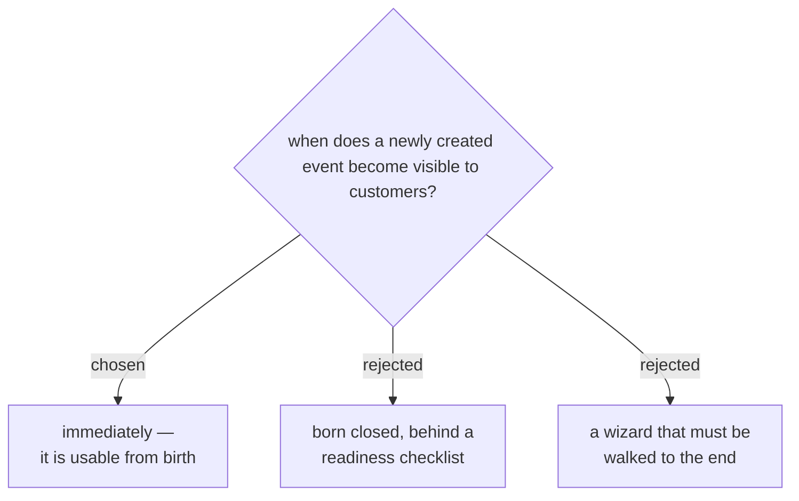

# A new event opens to the public the moment it is created

The argument for a gate was that a fresh event reaches customers half-built.
Checked against the code, it does not:

- `createEventFile_` seeds a working form — ชื่อ–นามสกุล, อีเมล,
  เบอร์โทรศัพท์, all required. A brand-new event can take registrations the
  second it exists.
- With [[events-checkin-0024]] a missing banner is a designed 1NEVE surface
  rather than a broken-looking swatch.
- `price_label` defaults to *ไม่มีค่าใช้จ่าย*, and 1NEVE's events are
  overwhelmingly free — when one is not, money is not this team's to handle
  anyway, so no payment flow is implied.

That leaves nothing a customer would encounter as wrong. A checklist gate
would exist to prevent a failure that does not happen, and would introduce one
that does: an event announced publicly, created in the console, and left
closed because nobody remembered the last switch.

So the console keeps its current behaviour — `open` is `true` at creation —
and the work goes into making every setting *reachable and changeable
afterwards* rather than into a ceremony before.

`open` still gets its switch. `register()` already refuses a closed event
server-side (`event_closed`), so the control is real; it is simply for
closing registration when the room fills, not for holding a new event back.
