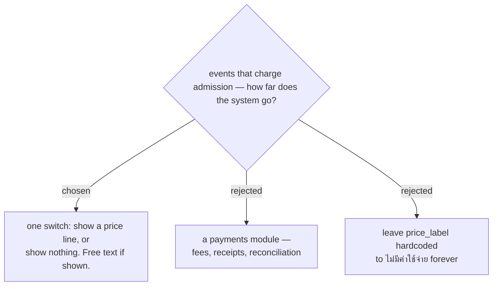

# The price line is a switch, not a payment system

`svcCreateEvent_` stamps *ไม่มีค่าใช้จ่าย* into `price_label` and no screen
can change it afterwards. The obvious reading is that a paid event would
advertise itself as free — but 1NEVE's events are almost always free, and
where one is not, collecting the money is not this team's job. Nobody here
reconciles a payment, so nothing in this system should imply it can.

So the fix is proportionate to the actual gap: the line becomes a switch on
the event settings screen. Off, the customer sees no price line at all. On,
it shows whatever text is typed — *฿500*, *ฟรีสำหรับสมาชิก*, *ติดต่อผู้จัด*.
Free text, because the label is a sentence to a reader, not a number to an
accountant.

Building payments would mean handling money the team does not handle, and a
system that takes a payment owes the payer a receipt, a refund path, and a
reconciliation trail — none of which exist or are wanted. A switch that is
honest about showing or not showing a line is the whole requirement.
