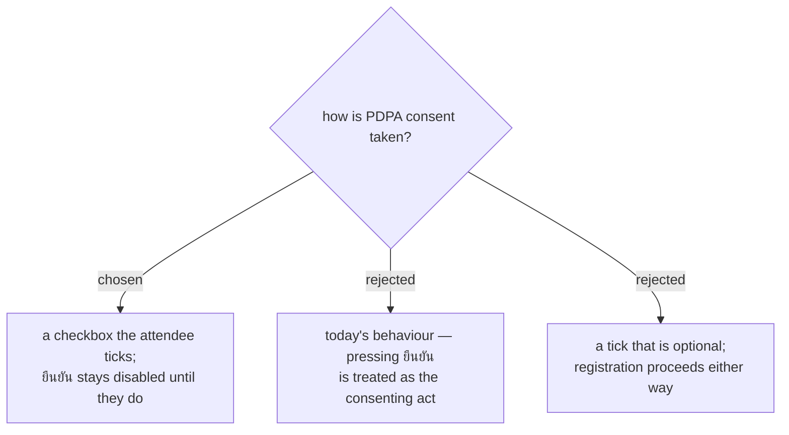

# Consent is a real tick, and registration requires it

Today the customer app sends `consent: !!ev.pdpa` — the value comes from the
event's switch, not from anything the attendee did. A timestamp lands in
`consent_at` for a person who was shown a sentence and pressed a button
labelled ยืนยันการลงทะเบียน. The record exists; the act it records does not.

So the notice becomes a checkbox, and ยืนยัน is disabled until it is ticked.

**Optional consent was considered and rejected, for a reason specific to this
arrangement.** The instinct — let people register without agreeing — is the
right one when consent covers an *extra* use. Here it does not. 1NEVE runs
registration on behalf of the ผู้จัดงาน, who is the ผู้ควบคุมข้อมูล; the
attendee is registering *for that Organizer's event*. Data reaching the
Organizer is not a bonus bolted onto the service, it **is** the service. A tick
that could be refused while registration continued anyway would be decoration,
and asking a question whose answer changes nothing is worse than not asking.

What the required tick actually buys is smaller than it looks, and worth being
precise about: it does not shift liability, and consent given as a condition of
service is not the strongest basis in law. It buys one thing — the attendee
**sees** the notice before the data is sent, and `consent_at` afterwards
records something that genuinely happened.

Consequences in code: `consent: !!ev.pdpa` becomes the checkbox's own state,
and `register()`'s `consent_required` error becomes reachable for the first
time — today it can never fire, because the client always sends `true` whenever
the server would demand it.
