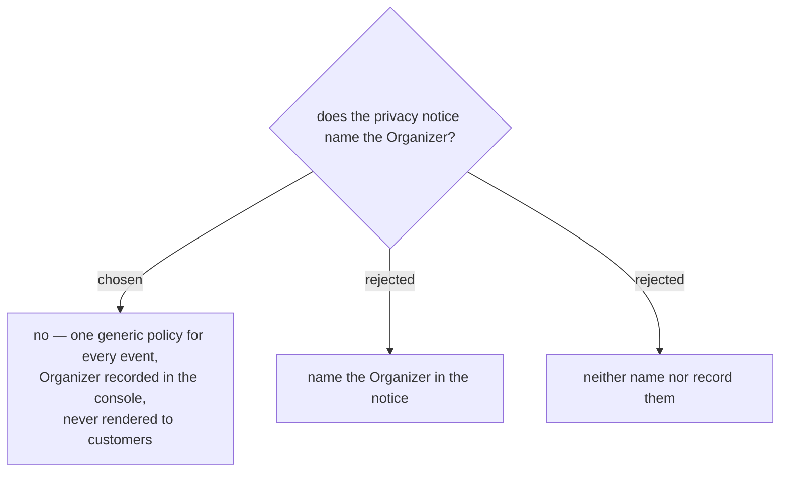

# One generic policy; the Organizer is known to the system, not shown to attendees

One policy document, identical for every event, with no per-event content in
it at all. This repo has spent a week deleting text that described things that
were not there; a notice assembled per event is a notice that can go stale per
event.

**The Organizer is not named to attendees.** The event's own name usually
carries that, and 1NEVE would rather publish one page it can keep true than N
pages it cannot.

**But the system records who they are.** Two fields on the event settings
screen — ชื่อผู้จัดงาน and a contact — that are never sent to the customer
site.

The alternative of not recording them at all was rejected once the consequence
was concrete: an attendee who wants their data deleted reads the policy, finds
1NEVE as the only named party, and writes to 1NEVE. Someone then has to
establish who commissioned that event before anything can happen. Declining to
name the Organizer publicly is a choice about what customers see; it must not
also mean nobody at 1NEVE can answer the question. Not showing them and not
knowing them are different, and only the first was wanted.

## What this settles about who answers

With no Organizer named publicly, 1NEVE is the front door for every
data-subject request by construction. That is a workload accepted knowingly,
not an accident — and it is exactly why the internal fields exist.

## What this does not do

Nothing here limits 1NEVE's liability. What allocates responsibility between
ผู้ควบคุมข้อมูล and ผู้ประมวลผลข้อมูล is the written agreement with each
Organizer, which is paper, needs a Thai lawyer, and is outside this repo. A
privacy notice — however carefully worded — allocates nothing. Separately, the
security of the system is 1NEVE's own duty as processor and cannot be
contracted away to anyone.
