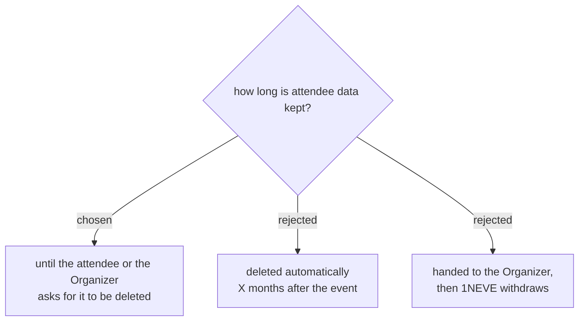

# Data is kept until someone asks for it to be gone

The policy states what the system does, and the system deletes nothing on a
timer. Saying otherwise would put a promise in writing that today's code
cannot keep.

**Automatic expiry was rejected on cost, not principle.** It needs three
things that do not exist: a machine-readable event date (`date_display` is
free text — *15 มี.ค. 70*), a daily time-driven trigger where the project has
none, and a decision about whether expiry clears a row or only its contact
columns. A trigger that quietly stops firing turns the published policy into a
false statement, and nobody would notice for months. Worth building later,
against a real date column; not worth promising now.

**Handing the file over and withdrawing was rejected on architecture.** It
fits the ผู้ประมวลผล role best, but registrations live in two places: the
event's own file and the `AllRegistrations` mirror in the Overview file. The
mirror is what `getMyPass` reads, so the phone-number pass lookup depends on
1NEVE continuing to hold exactly the data this option would remove.

## The obligation this creates

A retention policy of "until asked" is only honest if asking works. It does
not today:

- `svcDeleteAttendee_` writes `status = 'deleted'` and stops. Name, email and
  phone stay in the row in full.
- It never touches the `AllRegistrations` mirror. `getMyPass` filters on
  `status !== 'deleted'` while reading the mirror — a filter reading a column
  nothing updates, so a deleted attendee still finds their pass by phone.

Deletion must remove the personal columns in both places before this policy
can be published. That work is a precondition of the policy, not a follow-up
to it.
