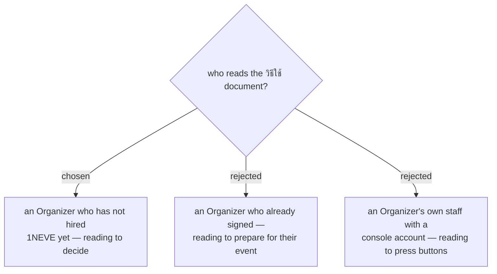

# The guide is written for a prospect, not an operator

The document is a sales instrument. Its reader has not signed anything and
owes 1NEVE nothing; they finish it and either ask for a quote or close the tab.

That settles a question the phrase *วิธีใช้* would otherwise leave open. It is
not a manual. Nobody reading it will operate the console — 1NEVE's own staff do
that, and this reader has no account. So the document shows **what happens**
when you run an event with 1NEVE, never **which button to press**.

The two rejected readers are real and may each get their own document later.
They were rejected as the audience for *this* one because a single document
cannot serve all three: an onboarding reader needs a timeline and file
specifications the prospect does not care about, and an operator needs
screen-by-screen instructions that would bore a prospect into closing it.

**A capability worth knowing while writing it:** `event_scope` in the Team
Access sheet accepts either `ALL` or a comma-separated list of event ids, and
roles are `STAFF` or `ADMIN`. So an Organizer's own person *can* be given a
console login limited to their event alone. That is a selling point the
prospect may care about — "you can watch your own numbers live" — even though
this reader will not be the one doing it.

## What this does not decide

Format, length, whether real screens appear, and which doubt the document
leads with are all still open. This ADR fixes only the reader.
