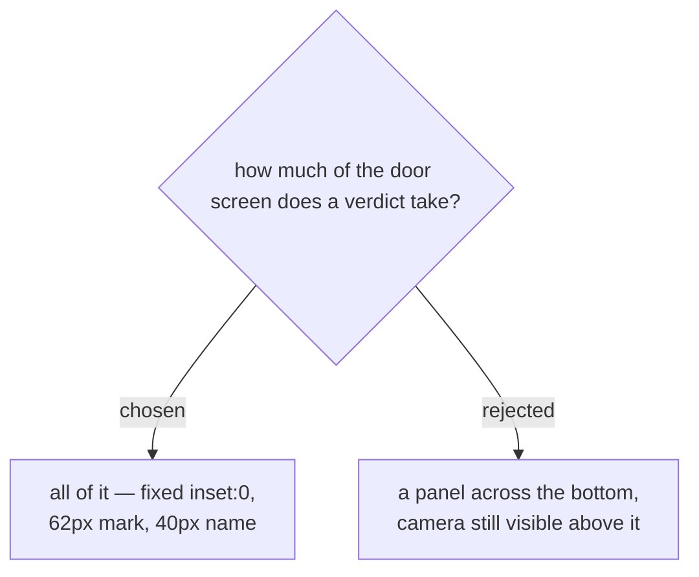

# The verdict keeps the whole screen

Confirmed by looking rather than by argument: both treatments were built into an
interactive mockup, at the real timings, and compared by pressing them.

The bottom panel is genuinely better on one axis — the camera stays visible, so
the queue keeps moving without the operator dismissing anything. It loses on the
axis that matters more at a door. Its text is roughly half the size, and a
verdict is read by somebody who is usually looking at a person, not at a phone.
A red panel glimpsed at the edge of vision is a red panel missed.

So nothing changes here: `.verdict` stays `position:fixed; inset:0` with the
62px mark and the 40px name it already has.

**This matters mostly as a correction.** The walkthrough at
`customer/guide.html` drew the verdict as a small bottom strip, which is not
what the product does. That drawing is what prompted the question, and it was
wrong — the real screen is the better of the two designs, and the document was
underselling it to the customers it exists to be shown to. The guide is
corrected to match.

## What the panel would have bought, recorded so it is not re-litigated

Reading resumes the moment an answer lands (ADR 0022), so the queue is *already*
moving while a verdict is up — the operator does not have to dismiss anything
before the next badge can be read. The panel's main advantage was therefore
smaller than it looked: it would have kept the camera *visible*, not kept the
queue *running*. The queue was never blocked.
