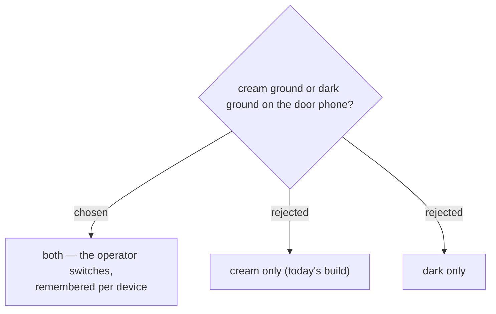

# The door screen has a theme switch, chosen per device

Neither ground wins outright, because the room decides. A daytime conference
hall is bright and cream reads better in it; a launch party at 19:00 is dim and
a cream screen is a lamp held at arm's length all evening, dragging the
operator's eyes away from the faces they are checking.

So the operator picks, and the phone remembers. Stored in `localStorage`
alongside the keys the app already keeps per device — `gate-event`,
`gate-device` — because the choice belongs to *that phone in that room*, not to
the staff member's account. The same person works a bright hall on Tuesday and
a dark one on Friday.

**The dark ground is a change of chrome only.** The camera well is already
`--well:#13110c`, the verdict already fills the screen in its own colour
(ADR 0031), and the accent stays `#d8482b` throughout. What changes is the top
bar, the manual-code row, the tab bar and the list pane — four surfaces that are
cream today.

That keeps the reason the cream ground was chosen in the first place partly
intact even in dark: the corner brackets, the เริ่มสแกน button and the selected
tab all stay vermilion, so a guest glancing at the staff phone still sees a
colour they recognise from the site they registered on.

## Where the control sits, and what it starts as

A sun/moon button in the top bar, beside the online pill.

The two safer placements — buried at the foot of the เพิ่งสแกน tab, or behind a
tap on the staff name — were rejected for the same reason: nothing about them
says they exist. A setting an operator reaches for once, at the start of a
shift, has to be findable without being told, and hiding it to prevent stray
taps trades a real cost for an imaginary one. A stray tap flips the ground and
is undone by tapping again; nothing is lost and the mistake announces itself.

**Before anyone chooses, the app follows the phone.** `prefers-color-scheme`
supplies the starting ground and the button overrides it, storing `gate-theme`
for that device. Staff who already run their phone dark get a
dark door screen without touching anything; staff who do not get the cream one
they have today. Nobody's screen changes out from under them on the day this
ships — which is the point of starting from the phone rather than from a
default we picked.
