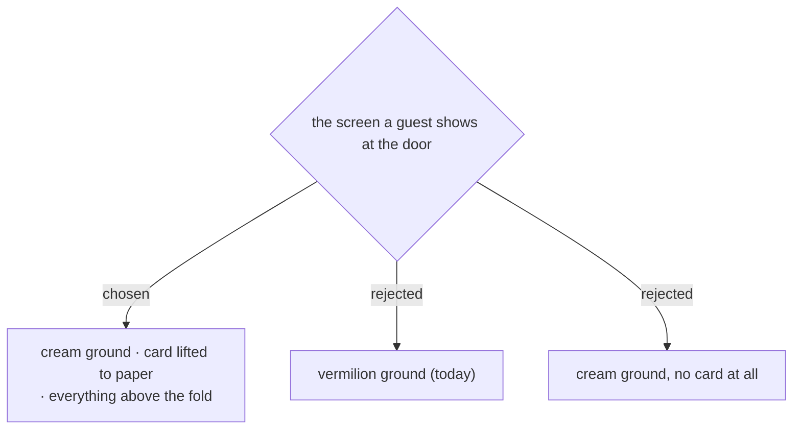

# The pass sits on cream, in a lifted card, and fits one screen

Measured against the running code, not estimated: the pass screen is **1021px
tall in a 760px viewport**. A guest opens it at the door and has to scroll
before the QR is fully visible, and the บันทึกรูป button is 261px below the
fold — a button for people who expect the venue's signal to fail, placed where
they will not find it.

Two blocks cause the overflow, and they are the two a walkthrough mockup had
quietly dropped: a three-line note at the top, and four label/value rows
beneath the card. **Neither is removed here.** The rows become two lines of
sentence, the note becomes one line, and the sentence about reopening the pass
moves down to sit beside the phone number that actually does the reopening.

`15 มี.ค. 70` was printed twice — once in the card's own footer and again as
the first of the four rows. One copy goes.

## The ground

Vermilion is dropped, and it costs something real: every screen before this one
is cream, so the switch to a full orange field was the app saying *done* without
words. That beat is gone.

What replaces it is consistency — the pass now belongs to the same world as the
form that produced it — and a screen that is easier to hold up in a bright
foyer. The 34px title still carries the moment; it is by far the largest thing
on the page.

**The card has to lift.** A cream card on a cream ground disappears, so the
card moves to `#fff5ef` with a faint shadow. That is why the third option —
cream with no card at all, which is literally what the mockup drew — was
rejected: it reads cleanly in a picture, but it throws away the one thing on
this screen that is meant to look like an object you hold out to somebody.

## Where the mockup was wrong, again

The walkthrough drew this screen on cream **by accident** — it reused the
container the form screens use. The client saw it, preferred it, and asked for
it. That is a real preference arrived at by looking, and it stands. But it is
the third screen in this document that the mockup misrepresented, after the
door app's ground and its verdict. `customer/guide.html` is corrected to match
what ships.
