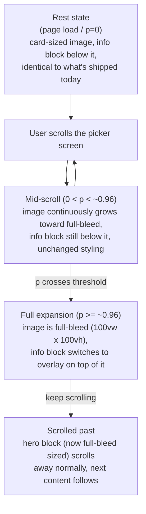

# Hero banner: full-bleed scroll expansion with overlay CTA



## Context

The picker screen (`customer/app.js` `renderPick()` + `customer/styles.css`)
already has a scroll-linked hero reveal, built earlier in this same working
session: each event section's image grows from a small card to fill its
column as the section crosses the viewport, computed continuously via
`onHeroScroll()` reading `getBoundingClientRect()` — no animation library, no
scroll-jacking. Since the picker was just cut down to a single event (`tt`,
ThinkTech Summit 2026 — the other three demo events are hidden via the
existing hide/show feature, not removed), this hero is effectively the whole
landing experience now.

This spec extends that existing mechanism to two new behaviors the user
asked for by picturing the interaction directly: the image growing to true
full-bleed instead of just filling its column, and the event info + CTA
button moving to overlay on top of the image once it's fully expanded,
rather than staying in a block below it.

## Decisions

Grilled and recorded as ADRs in `docs/adr/`:

- **events-checkin-0001** — full-bleed: the image breaks out of the
  `.screen-inner{max-width:440px}` column entirely at full scroll, edge to
  edge — not just filling the column's own width.
- **events-checkin-0002** — the info block (kicker/name/place/facts/CTA)
  starts below the image exactly as shipped today, and switches to overlay
  only once the image reaches full expansion — not pinned on top from the
  start.
- **events-checkin-0003** — the existing pass-through mechanism stays: no
  `position: sticky` pinning, no scroll-jacking. The screen never holds
  still — scroll input keeps moving the page the whole time; only the
  interpolated *values* (width, height, radius, overlay threshold) are a
  function of how far the section has crossed the viewport.

## Behavior spec

### Progress value (unchanged)

`onHeroScroll()` already computes, per hero section, on every scroll/resize
(rAF-throttled):

```js
const rect = wrap.getBoundingClientRect();
const p = Math.max(0, Math.min(1, (vh - rect.top) / vh));
```

`p` is 0 when the section's top is at the viewport's bottom edge, 1 when its
top reaches the viewport's top edge. This spec adds new interpolations
driven by the same `p`; it does not change how `p` itself is computed.

### Sizing — width, height, corner radius

Currently (`styles.css`): `.hero-media` is `width:56%` (of the padded
column) fixed at every `p`, only `height:64vh` (capped `max-height:560px`)
and `border-radius` (0 → 22px) vary with `p`, via inline styles `onHeroScroll()`
already sets.

New target at `p=1`: `width` reaches `100vw`, `height` reaches `100vh`,
`max-height` cap is dropped (it only made sense for the card-sized state),
and `border-radius` returns to `0` (a rounded corner at a true screen edge
reads as a bug, not a feature — the curve below rises then eases back down
so it never reads as a hard toggle).

```js
const startW = wrap.clientWidth * 0.56;      // ~today's card width, in px
const endW   = window.innerWidth;             // true viewport width
const w      = startW + p * (endW - startW);
media.style.width = w + "px";

const startH = vh * 0.64, endH = vh;           // today's 64vh -> 100vh
media.style.height = (startH + p * (endH - startH)) + "px";

// radius: rises through the reveal, eases back to 0 as it nears full-bleed
// (today's 0->22px curve, mirrored back down in the last stretch)
const radius = p < 0.7 ? (p / 0.7) * 22 : 22 * (1 - (p - 0.7) / 0.3);
media.style.borderRadius = radius + "px";
```

### Breaking out of the 440px column

`.hero-media` gets `position:relative; left:50%; transform:translateX(-50%)`
in the stylesheet (static, not JS-driven). Because `.screen{display:flex;
justify-content:center}` already centers `.screen-inner` on the true
viewport, `left:50%; translateX(-50%)` on `.hero-media` centers *it* on the
viewport too, at any width — so the same interpolated `width` value in px,
however large, stays centered and bleeds symmetrically past the column's own
edges once it exceeds the column's width. No JS-computed offset needed
beyond the width itself; no ancestor needs `overflow` changes, since nothing
upstream currently clips (`.screen`, `.screen-inner`, `body` have no
`overflow:hidden`).

### Info/CTA overlay switch

At `p >= 0.96` (i.e. "scrolled all the way," matching the phrase that
triggered this design), `onHeroScroll()` adds a class to the section:

```js
wrap.closest(".hero-event").classList.toggle("is-full", p >= 0.96);
```

`.hero-info` is a DOM *sibling* of `.hero-media-wrap`, not a child of it (see
`renderPick()`'s markup), so it can't anchor to the image directly — it has
to anchor to their shared parent, `.hero-event`, which needs
`position:relative` added for this to work. `.hero-event` also carries its
own `padding:0 0 46px` (spacing before the next section) which would land
absolutely-positioned content 46px below the image's real bottom edge if
naively pinned to `bottom:0` — so the offset compensates for exactly that:

```css
.hero-event{position:relative} /* was: no position set */
.hero-event.is-full .hero-info{
  position:absolute; left:0; right:0; bottom:46px; padding:0 26px 26px;
  color:#fff;
}
.hero-event.is-full .hero-kicker{color:#ffb3a2}
.hero-event.is-full .hero-place{color:rgba(255,255,255,.82)}
```

`.hero-media-scrim`'s gradient already darkens toward the bottom and fades to
transparent at the top (`linear-gradient(to top, rgba(19,17,12,.75) 0%,
rgba(19,17,12,.15) 55%, rgba(19,17,12,0) 100%)` — `0%` is the bottom edge in
a `to top` gradient) — it was already shaped for bottom-anchored text, just
not load-bearing for contrast until now, since nothing sat on it before.
Strengthen the bottom stop so it holds up under white text at any photo:

```css
.hero-media-scrim{background:linear-gradient(to top,
  rgba(19,17,12,.85) 0%, rgba(19,17,12,.3) 35%, rgba(19,17,12,0) 100%)}
```

The threshold is a simple class toggle rather than a separately-timed
transition — deliberately, to stay consistent with events-checkin-0003
(everything here is a function of scroll position, nothing runs on its own
clock). It doesn't read as a jump because the image itself is barely
changing size that close to `p=1`.

`.hero-event:not(.is-full) .hero-info` needs no override — it's exactly
today's static, below-image, dark-on-cream block.

## Out of scope (unchanged)

- Registration flow after the CTA click (4-step form → QR) — untouched, same
  as every prior change to this screen this session.
- The badge/print theming and per-event THEME accent colors
  (`editorial`/`brass`/`onyx`/`forest`/`ink`) — this spec only touches hero
  layout/sizing, not event branding colors.
- Multi-event behavior when a hidden event is un-hidden again — the existing
  per-section `p` calculation already handles N sections independently; this
  spec doesn't change that.

## Verification plan

1. `node --check` on `customer/app.js` after the edit.
2. Preview locally via `file://customer/index.html` in the same
   chrome-devtools flow used for the last two hero changes, before pushing:
   confirm at `p≈0`, `p≈0.5`, and `p≈1` (scroll to computed offsets) that
   width/height/radius track smoothly and the overlay switches only near
   full expansion.
3. Confirm content below the hero (the "already registered? open my QR"
   link) still appears normally once scrolled past.
4. Click the CTA in both the resting and overlay states — confirm it still
   opens the same registration flow (`hero-enter` action is untouched).
5. Deploy: `sync-docs.sh`, commit, push, verify on the live Vercel URL same
   as every prior change this session.
