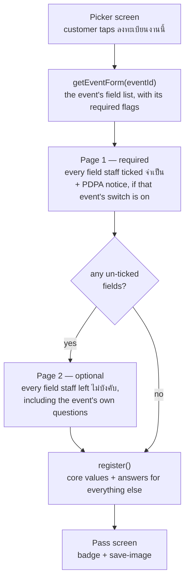
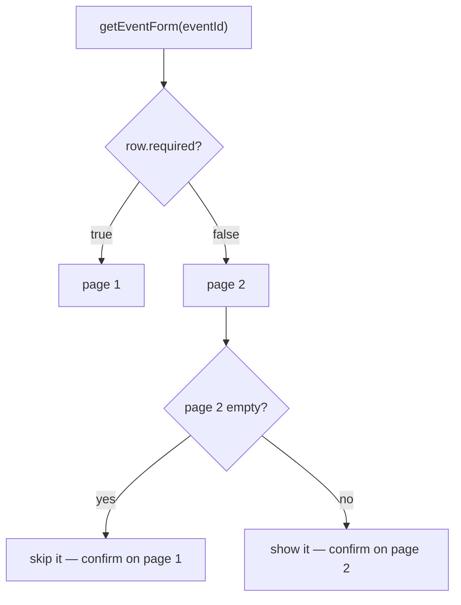
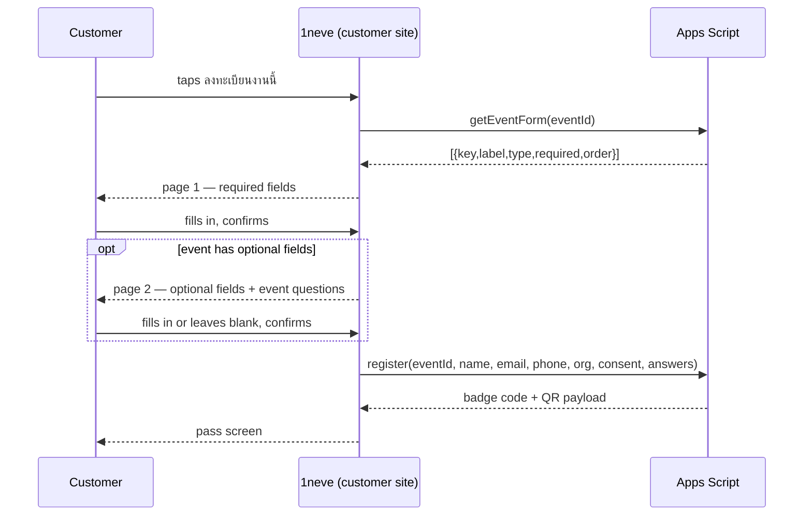

# Two-page registration, driven by each event's own field list



## Context

Registration today asks one question per screen — name, then email, then
phone, then organisation with a PDPA tick box — so a customer taps "ถัดไป"
four times to hand over four values. The user's verdict was blunt:
*"หลายขั้นตอนเกิน ดูน่ารำคาญสำหรับลูกค้า"*.

The field set is hardcoded in `COPY[lang].steps` in `customer/app.js`, and
the customer site has never read the per-event `Fields` sheet the back end
maintains. The Staff Console's own field editor says as much on screen:
*"ตอนนี้บันทึกลงชีตแล้ว แต่หน้าลูกค้ายังใช้ฟอร์ม 5 ขั้นแบบตายตัวอยู่ จะเชื่อมให้ฟอร์มลูกค้า
อ่านฟิลด์ชุดนี้จริงในขั้นถัดไป"*. This is that step.

Two faults on the pass screen were found while grilling and are folded in,
because they mislead customers today:

```js
case "save-img":   flash(t().toastImg);    break;   // "บันทึกรูป QR ลงเครื่องแล้ว"
case "add-wallet": flash(t().toastWallet); break;   // "เพิ่มบัตรใน Wallet แล้ว"
```

Both report success and do nothing.

## Confirmed mockup

The flow was built and confirmed as a tappable prototype before any code was
written — including the two-page case, the single-page case, and the PDPA
switch in both positions:

**https://claude.ai/code/artifact/88d7ff0b-2f97-479c-a76b-8d5ec455a032**

## Decisions

Recorded as ADRs in `docs/adr/`:

- **0006** — two pages split by required vs optional, not one question per
  screen and not a single flat page.
- **0007** — the optional page carries the event's own questions; the page
  split is exactly the `required` column of the `Fields` sheet.
- **0008** — an event with no optional fields skips the second page and goes
  straight to the QR.
- **0009** — any key the site already ships copy for (`name`, `email`,
  `phone`, `org`) keeps its translation, matched by key; event questions
  show the sheet's label as written.
- **0010** — PDPA consent becomes a line under the confirm button, behind a
  per-event switch that starts off.
- **0011** — the WALLET button is removed rather than implemented.
- **0012** — save-image writes the whole badge, drawn on a canvas, and the
  success toast fires only on an actual save.

Two more settled during grilling without an ADR of their own, both forced
rather than chosen: the phone stays required (`register()` already rejects
anything shorter than 9 digits, so moving it would have meant a backend
change nobody wanted), and the PDPA line lives on page 1 whenever page 2 is
skipped — otherwise an event with no optional fields would submit without
ever showing the terms.

## Page composition



The live `tt` event returns exactly this list today, which is the shape the
implementation must handle:

| key | label | type | required | order |
|---|---|---|---|---|
| `name` | ชื่อ–นามสกุล | TEXT | true | 1 |
| `email` | อีเมล | EMAIL | true | 2 |
| `phone` | เบอร์โทรศัพท์ | PHONE | true | 3 |
| `org` | บริษัท / องค์กร | TEXT | false | 4 |

Fields render in `sort_order`. A field's `type` picks the input mode —
`EMAIL` → `type="email"`, `PHONE` → `type="tel"`, anything else → text. The
Staff Console writes `TEXT` for every field it adds
(`staff/staff.js:1002`), so only the three seeded rows ever carry `EMAIL` or
`PHONE`.

**Labels.** A field whose key the site already ships copy for — `name`,
`email`, `phone`, `org` — uses that copy, so the English form keeps working.
Every other field shows its sheet `label` as-is, in whatever language staff
typed. On page 2, event questions sit under a divider reading
`คำถามของงานนี้` / `About this event`, so it is clear they belong to the event
rather than to the site.

The existing copy does not supply what a labelled form needs. `COPY[lang].steps`
holds a question per screen and a placeholder:

| key | `q` (TH) | `ph` (TH) | `q` (EN) | `ph` (EN) |
|---|---|---|---|---|
| `name` | คุณชื่อ / อะไร? | ชื่อ–นามสกุล | What's / your name? | Full name |
| `email` | อีเมล / ของคุณ | name@company.com | Your / email | name@company.com |
| `phone` | เบอร์ติดต่อ / หน้างาน | 08X XXX XXXX | Contact / number | 08X XXX XXXX |
| `org` | ทำงานที่ / ไหน? | ชื่อบริษัทหรือองค์กร | Where do / you work? | Company or organisation |

So this change adds a short `fieldLabels` map to `COPY` for those four keys
in both languages (`ชื่อ–นามสกุล` / `Full name`, `อีเมล` / `Email`,
`เบอร์โทรศัพท์` / `Phone number`, `บริษัท / องค์กร` / `Company or organisation`),
keeps `ph` as the placeholder where it carries format (`name@company.com`,
`08X XXX XXXX`), and drops the per-field `helper` strings — a page-level
sub-heading replaces them, since four helpers stacked on one screen is
noise. The `q` and `helper` wording is not reused per field.

**Validation.** All required fields are checked at once on submit, and every
failing field shows its own message at the same time — the current flow can
only ever show one error, because it only ever shows one field. Rules keep
the existing semantics: `name` non-empty; `email` against
`/^[^@\s]+@[^@\s]+\.[a-z]{2,}$/i`; `phone` at least 9 digits after stripping
non-digits; any other required field non-empty. These mirror `register()`'s
own server-side checks, which stay as the real gate.

**Email chips.** The `@gmail.com` / `@corp.co.th` quick-append chips survive,
rendered under the email field only.

**Buttons.** Page 1 confirms with `ถัดไป` when a second page follows and
`ยืนยันและรับ QR` when it does not. Page 2 has one button, `ยืนยันและรับ QR` —
the separate `ข้าม` is dropped, because the page is optional anyway and a
customer who had typed an answer could lose it to a mis-tap.

## PDPA switch

When the event's `pdpa` flag is on, a line sits under whichever button
submits: *"การกดยืนยันถือว่าคุณยอมรับ **นโยบาย PDPA** ของผู้จัดงาน"*. When the flag is
off, no line is shown and `consent` is not sent, so `consent_at` stays empty
rather than recording something that did not happen.

The flag starts off for every event, which is what the user asked for
(*"ยังไม่ใช้งานตอนนี้"*).

## Data flow



## Changes by file

**`customer/api.js`** — add
`getEventForm: id => get({ action: "getEventForm", eventId: id })`. The
action is already public and already routed (`Code.gs:319`).

**`customer/app.js`** — the bulk of the work.

- `state` loses `step` and gains the fetched field list plus a `vals` map
  keyed by field key rather than the fixed `{name,email,phone,org}` object.
  `state.consent` and `state.consentError` go with the tick box.
- `renderAsk()` renders a whole page of fields instead of one question,
  driven by the fetched list; the giant `step-num` and the four-tick
  indicator give way to a page eyebrow (`ขั้นที่ 1 · จำเป็น`) and a tick per
  actual page.
- The five places currently coupled to `c.steps[state.step]` — `renderAsk`,
  the focus/typing binding, the chip handler, `next()`/`back()` and
  `stepError()` — are reworked against the fetched list.
- `submit()` sends `answers` alongside the core values.
- The pass screen loses its WALLET button; `save-img` gets a real
  implementation per ADR 0012, and the `add-wallet` case and `toastWallet`
  copy are deleted.

**`backend/Code.gs`** (staff-console repo) — three changes.

- `register()` accepts `p.answers` (an object keyed by field key) and writes
  it into `answers_json` in place of the current
  `JSON.stringify({ org: org })` placeholder, keeping `org` in the object so
  nothing that reads it breaks. Values are coerced to strings and the object
  is ignored if it is not a plain object.
- `register()` demands `consent` only when the event's `pdpa` flag is on.
- `pdpa` is appended to `EVENTS_HEADERS`; `allEventsRows_` gains
  `pdpa: isTrue_(o.pdpa)` — it maps column by column, so this does not come
  for free — and `svcSetEventProp_` gains `if (p.pdpa !== undefined) …`
  alongside its existing `open` and `hidden` handling.

**`staff/staff.js`** (staff-console repo) — a PDPA on/off control on the
event's settings, next to the existing open/hidden toggles, calling
`setEventProp` with `pdpa`. `svcSetEventProp_` is `requireStaff_(eventId, 'ADMIN')`,
so like the other event switches this one is admin-only — which is
appropriate for a control that governs a consent record.

## Deployment

`migrateHeaders_` adds the `pdpa` column to the existing Events sheet, but it
only runs from `setupSheets()` — so `setupSheets()` must be run once after
the backend deploy, before anyone touches the new switch, or
`svcSetEventProp_` will write to a column that does not exist. Both Apps
Script deployments (the customer "Anyone" one and the legacy staff one) need
redeploying, as with every prior backend change this project has made.

## Out of scope

- **Translating event questions.** The `Fields` sheet has one `label` and no
  language column, so an English visitor reads translated core questions and
  Thai event questions. Fixing it means a second label column and somewhere
  in the Staff Console to type it — deliberately not here.
- **A real Wallet pass.** Removed, not built (ADR 0011).
- **Field types beyond text.** The Staff Console writes `TEXT` for every
  field it adds; dropdowns, dates and checkboxes would need a type control
  there first.
- **The picker screen.** Untouched — its scroll behaviour was settled in ADR
  0004/0005 and nothing here changes it.
- **`getMyPass` and the lookup screen.** Untouched.

## Verification plan

1. `node --check` on `customer/app.js` and `customer/api.js` after editing.
2. `node --check` on a `.js` copy of `Code.gs` (Node cannot check `.gs` by
   extension) before pushing with clasp.
3. Against the live `tt` event, which has one optional field: confirm two
   pages, that all three required errors can appear at once, and that the
   optional page can be submitted blank.
4. Temporarily mark `org` จำเป็น from the Staff Console and reload: it must
   move to page 1 and start being enforced. Then set it back.
5. Temporarily delete `org` from the event's fields: the second page must
   disappear entirely and page 1's button must read `ยืนยันและรับ QR`. Then
   restore it.
6. Add an event question from the Staff Console and confirm it appears on
   page 2 under the divider, and that its answer lands in `answers_json` on
   the Registrations row.
7. With `pdpa` off, register and confirm `consent_at` is empty. Turn it on,
   confirm the line appears under the submitting button, register again and
   confirm `consent_at` is stamped.
8. On the pass screen: tap บันทึกรูป and confirm an actual PNG of the whole
   badge arrives, on both a desktop browser and an iOS device — and that no
   success toast appears if the save is dismissed.
9. Confirm the English form shows English labels for all four keys the site
   ships copy for, and the sheet's own wording for an event question.
10. Deploy: `sync-docs.sh`, commit, push, verify on https://1neve.vercel.app.
