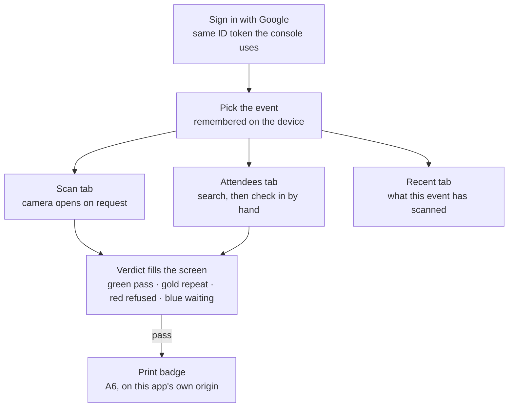

# The gate app: scanning, lookup and recent scans, on a phone



## Context

The Staff Console's scan screen draws a picture of a phone inside a
two-column desktop layout. Opened on the phone someone actually holds at a
door, measured at 390×760:

| | y |
|---|---|
| bottom of the screen | 760 |
| camera starts at | 684 — 76px of it visible |
| scan result card at | 1201 — **441px below the fold** |

So the person scanning cannot see whether a scan worked without scrolling
after every badge. A high or low beep is the only other signal, and a hall
takes that away too. This app exists to put the verdict where the eye
already is.

## Confirmed prototype

Built and confirmed before any of this was written — three tabs, the
full-screen verdicts, the camera gate and the offline state:

**https://claude.ai/code/artifact/59590a14-2ef0-460b-b7de-ef2d86fb296b**

The prototype is the reference for layout, colour and wording. It has no
backend; everything below is what connects it to the real one.

## Decisions

Recorded as ADRs in `docs/adr/`:

- **0013** — scanning leaves the console; attendees and history stay in both
  as different tools over the same data. The console keeps its scan screen
  until this app has carried one real event.
- **0014** — a repeat scan bumps `scan_count` instead of appending a
  Checkins row. Rejections still write one.
- **0016** — its own Vercel project and domain; the badge print page comes
  with it.
- **0017** — supersedes 0015: offline blocks check-in rather than queueing,
  because a badge's signature can only be verified server-side.
- **0018** — the camera opens when the operator asks, not when the screen
  renders.

## Where it lives

A `gate/` folder in the **staff-console** repo, served by its own Vercel
project pointing `rootDirectory` at `gate/`. Same repo because it speaks the
same backend contract and shares the same vendored libraries; its own
project because ADR 0016 wants its own origin.

No build step and no mirror folder. `staff/` is copied to `docs/` only
because GitHub Pages can serve a repo's root or its `/docs` and nothing
else — Vercel has no such rule and can serve `gate/` directly. Skipping the
mirror also skips the class of bug where someone edits the source, forgets
to run the sync script, and the deployed copy quietly stays behind.

```
staff-console/
  gate/
    index.html
    gate.js
    gate.css
    config.js          ← same two values as staff/config.js
    badge.html         ← moved from staff/, unchanged apart from its home
    vendor/
      jsQR.js          ← copies; Vercel scopes the project to this folder
      qrcode.js
```

**Prerequisite that blocks sign-in entirely:** the new domain has to be added
to the OAuth client's *Authorized JavaScript origins* in Google Cloud
Console → APIs & Services → Credentials. This cannot be done from code and
has to happen before anyone can sign in.

What it looks like when it has not been done was checked on the deployed app
rather than assumed, and it is worse than expected: the sign-in button
renders perfectly normally and pressing it simply achieves nothing. The only
evidence is a line in the browser console —
`[GSI_LOGGER]: The given origin is not allowed for the given client ID` —
which nobody standing at a door is going to see. The app therefore passes an
`error_callback` to `google.accounts.id.initialize` and shows the
`unregistered_origin` case on screen, naming the exact origin to add, so a
missing setting reads as a missing setting rather than a broken app.

## Signing in and picking an event

Identical to the console, deliberately: `google.accounts.id.initialize` with
`APP_CONFIG.GOOGLE_CLIENT_ID`, the returned credential stored under
`staff-id-token` with its decoded `exp`, and every call made as
`staffCall` with that token. `requireStaff_` decides what the caller may do;
the app never sends its own role.

`bootstrap` returns `{me, events, badge}`. The events it returns are the ones
this staff member's `event_scope` allows. The app asks which one on first
run, remembers it on the device, and offers a switch in the header. A member
scoped to a single event skips the question.

## The scan tab

**The camera.** Nothing opens until the operator taps to start (ADR 0018).
Tapping requests `getUserMedia({ video: { facingMode: "environment" } })`.
Leaving the tab stops the tracks. If the device has no camera, or permission
is refused, the tab says so and the code entry below still works.

**Decoding.** `jsQR` over frames drawn to a canvas, the same as the console.
A badge counts once per presentation: it has to leave the frame before it
counts again, and — carrying over the fix made to the console today — a code
is only recorded as seen once the request was actually sent, so a badge
presented while an earlier scan is still in flight is not swallowed.

**Sending.** `checkin` with `{ eventId, qr, device, clientScanId }`, a 25s
timeout, and no automatic re-send: a timed-out or refused scan leaves the
badge marked as seen, and the message asks for it to be presented again.

**The verdict** fills the screen, in the colour that says what to do before a
word is read:

| result | colour | what the operator does |
|---|---|---|
| `ok` | green `#2f6b4f` | wave them in — clears itself after 1.9s |
| `duplicate` | gold `#8a6512` | already inside; shows who checked them in and when |
| `wrong_event`, `bad_signature`, `not_found` | red `#c1391f` | cannot enter |
| offline | blue `#2f4d8c` | cannot check anyone in right now |

Only `ok` clears itself, because it is the only one the operator does
nothing about; a full screen left up blocks the camera and the queue waits
on a tap. The rest stay until dismissed.

The traffic-light assignment is deliberately not the console's, which paints
duplicates red and rejections amber. A repeat scan is a real guest who is
already inside — a warning. A rejected badge is someone who cannot go in —
a stop. Red belongs to the second.

**Offline.** "Offline" means requests are not succeeding, not what
`navigator.onLine` claims: a phone joined to a venue's wifi that has lost its
uplink reports itself online, which is exactly the case this must catch. A
failed or timed-out call flips the app into the waiting state, which blocks
scanning and says why; a lightweight probe against the API clears it.

## The attendees tab

`attendees` with the typed query. The server filters before it caps at 300
rows, so search reaches the whole event even though browsing does not.

A STAFF caller receives `regId, name, org, type, code, status, source, by,
at, gate` — `email` and `phone` come back empty, because `svcAttendees_`
withholds them from anyone below ADMIN. The app shows what it is given and
does not pretend otherwise: this is the door's copy of the list, not the
desk's.

Each row that is not yet in shows a check-in button calling `setCheckedIn`,
which is how someone gets in when their QR will not scan — a cracked screen,
a phone with no battery, a printed badge that smudged.

## The recent tab

`history` for the event, newest first, capped at 300 by the server. It shows
every operator's scans, not just this device's — at a gate with two doors,
"did someone else already deal with this person" is the question being
asked. Rejections appear here too, which is the reason ADR 0014 keeps
writing rows for them.

## Printing

`badge.html` moves from `staff/` to `gate/` unchanged. It reads the same
`staff-id-token` from its own origin and calls `badgeData`. The console loses
nothing it still needs: its badge screen designs badges, and printing one for
a person belongs where the person is standing.

## Backend change

One, from ADR 0014. In `svcCheckin_`, the already-checked-in branch keeps
incrementing `scan_count` but no longer calls `logScan_`:

```js
if (already) {
  t.sheet.getRange(rowNum, col.scan_count).setValue(Number(rec.scan_count || 1) + 1);
  // No Checkins row: every row is an appendRow under a script-wide lock, so a
  // repeat scan costs a queue as much as a real check-in does. What the log is
  // asked afterwards — is this person in, and who let them in — is answered by
  // the registration row, which still carries the first check-in's time, gate
  // and operator alongside the count.
  return { result: 'duplicate', ... };
}
```

Rejections and successful check-ins are untouched. Nothing else on the back
end changes: the app is a second front end over the API the console already
uses.

## What the console loses, and when

Its scan screen, and only that — after this app has carried one real event
(ADR 0013). Until then both exist, and the console's is the fallback if this
one meets something testing did not.

`staff/config.js` also carries a comment that is no longer true — it says the
legacy Apps Script deployment "still exists only to serve Badge.html", which
stopped being the case when `/exec` was turned into a redirect notice. It is
corrected as part of this work.

## Out of scope

- **Offline check-in.** Settled and rejected in ADR 0017.
- **Anything the desk does** — walk-ins, pass types, deleting an attendee,
  CSV export, badge design, team and roles all stay in the console.
- **Contact details at the door.** STAFF does not receive email or phone and
  this app will not ask for a role that would.
- **Removing the console's scan screen.** A later change, once this has
  proved itself.

## Verification plan

1. `node --check` on `gate/gate.js`, and on a `.js` copy of `Code.gs`.
2. With the OAuth origin added: sign in on the new domain and confirm
   `bootstrap` returns the events this account is scoped to.
3. Camera stays off until tapped; leaving the tab releases it (the browser's
   recording indicator is the check); refusing permission still leaves code
   entry working.
4. Against the harness, all five verdicts render full-screen in the right
   colour, and only `ok` clears itself.
5. Present a second badge while the first is still in flight — both check in.
6. Time a request out — the held badge does not re-send itself.
7. Kill the network — scanning blocks and says so; restore it and scanning
   resumes without a reload.
8. Scan a checked-in badge twice and confirm `scan_count` rises while the
   Checkins tab gains no row; scan a forged badge and confirm it does.
9. Search a name in Attendees, check them in from the row, confirm the
   registration row updates and no email or phone is on screen.
10. Print a badge from a successful scan on the new domain.
11. Deploy, then run the whole thing once on a real phone with a real camera
    against the live backend.
