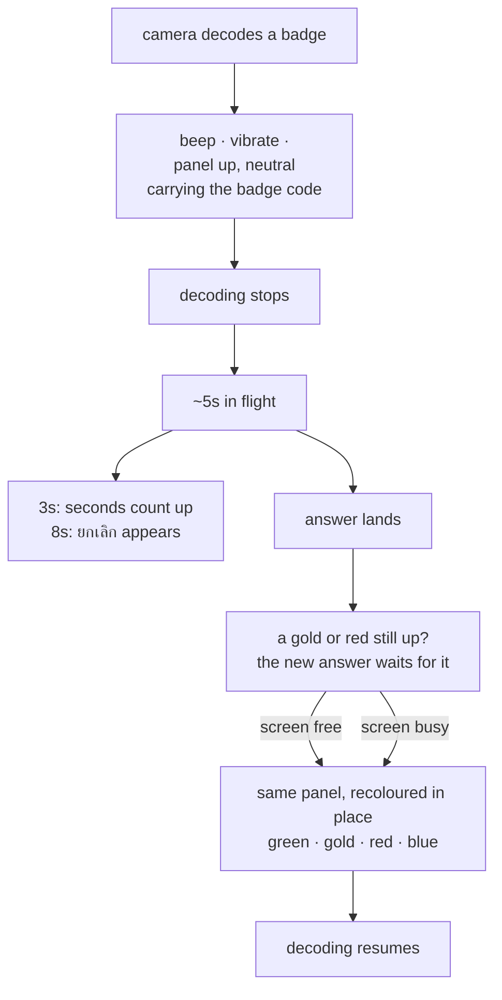
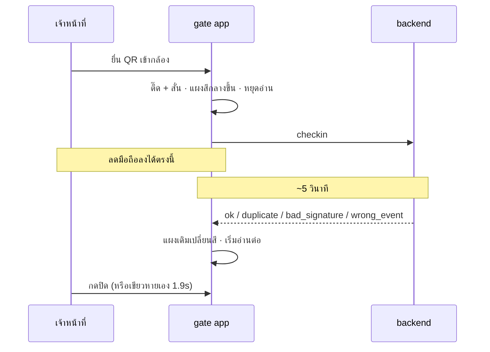

# The five seconds between reading a badge and knowing the answer

## The problem

A check-in takes about five seconds. Measured on the live backend today, not
estimated:

| | |
|---|---|
| 115 scans through five gates | **5.15s median**, 8.4s p95, 9.6s worst |
| one gate, nothing to queue behind | **5.6s median** — so this is not lock contention |
| a bare public `listEvents`, no auth, no event file | **2.5s** — the platform floor |
| opening the per-event spreadsheet | ~1.4s of the remainder |
| Apps Script stalling, seen twice in one session | **38s and 48s**, answering with an HTML error page |

For all five of those seconds the gate app shows **nothing**. `submitScan()`
sets `state.busy = true` and never calls `render()`, so from the instant the
camera reads a code until the verdict lands, the screen does not change. The
operator cannot tell a successful read from a camera that never focused, so
they hold the phone at the QR and wait — which is exactly what was reported.

The five seconds are not going away: 2.5s of them happen before any of our code
runs. What can change is that the operator stops being kept in the dark.

## Decisions

Recorded as ADRs in `docs/adr/`:

- **0019** — the read gets its own signal (beep, vibration, panel), and that
  signal must not look like approval.
- **0020** — one panel with two phases, recoloured in place, rather than two
  panels taking turns.
- **0021** — a slow check counts up from 3s and offers ยกเลิก at 8s; the 25s
  deadline stays.
- **0022** — pause the decoding, not the camera; reading resumes when the
  answer lands.
- **0023** — a verdict that needs acknowledging is never overwritten; the next
  answer waits for it.

**Confirmed mockup**, built from the app's own tokens and carrying a play
button that runs the real transition at the real timing:

**https://claude.ai/code/artifact/6319aa89-4b79-40f1-80c3-31671ec14c4f**

## What the operator sees

| moment | what is on screen |
|---|---|
| the code is decoded | panel up, `--well` #13110c, *รับรหัสแล้ว / กำลังตรวจ…*, the badge code |
| 3s later, only if it is slow | a line counting the seconds |
| 8s later, only if it is slow | **ยกเลิกแล้วยิงใหม่** |
| the answer, ~5s | the same panel becomes green / gold / red / blue, the name replaces *กำลังตรวจ…* |
| 25s with no answer | the same panel becomes blue — the existing offline verdict |

The neutral colour is `--well`, which is already the colour of the camera well
the panel covers. It reads as the picture holding still rather than as a
judgement, and it collides with none of the four verdict colours.

## Where the work is

Two files, both under `gate/`. Vercel serves that folder directly (Root
Directory `gate`), so there is no mirror to sync. **Nothing on the backend
changes** — no clasp push, no Apps Script redeploy, and the console and the
customer site are untouched.

### `gate/gate.js`

| function | line | change |
|---|---|---|
| `submitScan()` | 434 | raise the neutral panel, play the receipt, start the clock, pause decoding |
| `tick(gen)` | 399 | stop taking frames while a check is in flight, instead of decoding and discarding |
| `paintVerdict()` | 522 | recolour in place; hold the answer if an unacknowledged verdict is up |
| `hideVerdict()` | 543 | release a held answer, or resume decoding |
| `showResult()` | 481 | tell `paintVerdict` this is the second phase, not a new panel |
| `beep()` | 552 | a third, shorter tone for the receipt, plus `navigator.vibrate` |
| `act()` | 795 | a `cancel` action |

New module state: the held verdict, the moment the check started, and which
phase the panel is in.

**The typed-code path comes free.** `act("manual")` already routes through
`submitScan()`, so entering a badge code by hand raises the same panel with no
extra work.

### `gate/gate.css`

A neutral panel class over `--well`, a style for the counting line, and a
`background-color` transition so the recolour does not flash. The existing
`.verdict` rules are otherwise untouched.

## Rules that have to hold

- **The receipt never resembles a verdict.** No tick, no green, no verdict
  wording. At decode time the app knows only that it read a code — a forged
  badge decodes as cleanly as a real one.
- **Cancel abandons waiting, not the check-in.** The request may already have
  landed. Cancelling clears `lastCode` so the same badge can be presented again
  immediately, and the answer to that second attempt tells the operator what
  really happened — gold means the first one landed, green means it did not.
  This is the opposite of the 25s timeout, which deliberately keeps `lastCode`
  set so a badge sitting in frame does not re-send itself unasked.
- **Only `duplicate` and refusals hold the screen.** `ok` clears itself after
  `PASS_CLEAR_MS` (1900ms), so a green rarely delays anything.
- **The held answer is one deep.** A newer answer replaces an older waiting one
  rather than stacking; the older one is already recorded and visible in
  เพิ่งสแกน.
- **The neutral phase never waits and never auto-clears.** It is not a result.
  It ends when the answer replaces it, when the deadline turns it blue, or when
  the operator cancels.

## Known limitation

`navigator.vibrate` is not supported by Safari on iOS. An operator on an iPhone
gets the sound and the panel and no buzz. This is why ADR 0019 puts the panel —
not the vibration — at the centre of the design: the screen is the signal that
always survives, and the sound and the buzz are what let it arrive without
being looked at.

## Verification plan

1. `node --check gate/gate.js`.
2. Against the local harness on a 390×760 phone viewport: scan a valid badge
   and confirm the panel appears **before** the answer, in the neutral colour,
   carrying the badge code.
3. Confirm the panel recolours in place — capture the class and computed
   background at the neutral moment and again after the answer, and confirm the
   element is the same node and never loses its `up` class in between.
4. Hold a response artificially and confirm the counter appears at 3s and
   ยกเลิก at 8s, and that neither appears on a normal ~1s harness response.
5. Press ยกเลิก and confirm the same badge can be scanned again immediately.
6. Confirm no frames are decoded while a check is in flight — count `jsQR`
   calls across the wait.
7. Scan a badge that returns `bad_signature`, leave the red panel up, then
   scan a valid badge: the green must **not** appear until the red is
   dismissed, and must appear immediately when it is.
8. Confirm `ok` still clears itself after 1.9s and the other three still wait.
9. Type a code into the manual field and confirm it raises the same panel.
10. Kill the network and confirm the neutral panel becomes the blue offline
    verdict, and that nobody is admitted.
11. Deploy, then run one real scan on a phone against the live backend, where
    the wait is five seconds rather than the harness's one.
