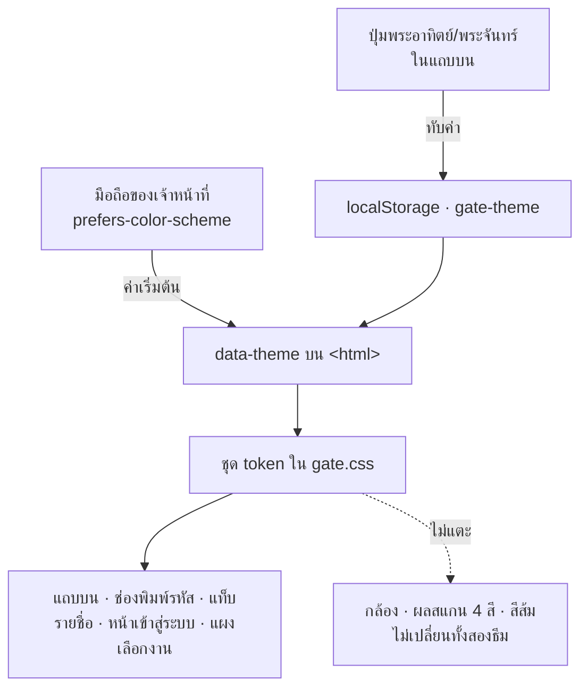
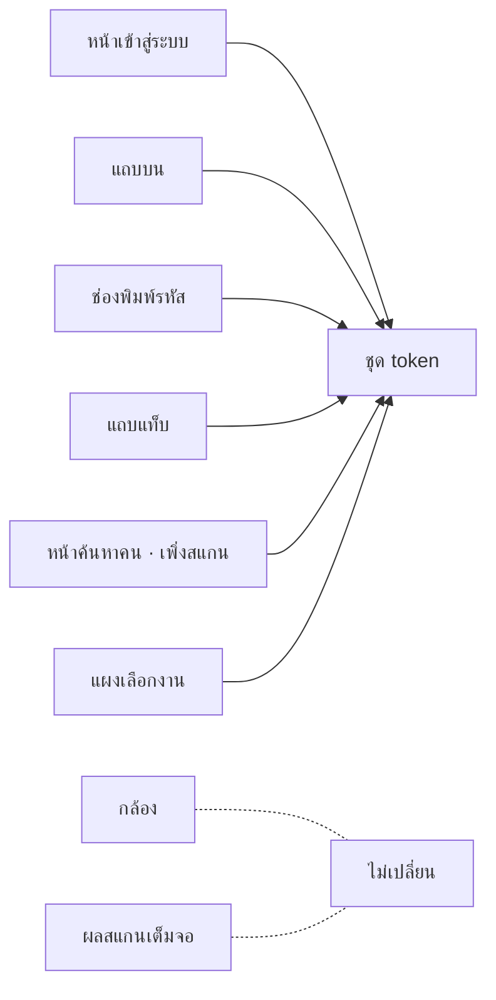

# สลับธีมสว่าง/เข้ม บนแอปหน้าประตู

**Spec สำหรับ:** `~/dev/staff-console/gate/` เท่านั้น · **ไม่แตะ** คอนโซล เว็บลูกค้า
หรือ backend

**Mockup ที่ยืนยันแล้ว:** https://claude.ai/code/artifact/47becba0-61ab-4750-aac1-ced4c0c57605

---

## ปัญหา

แอปหน้าประตูพื้นครีม `#f4f1e6` ตามเว็บลูกค้า เหตุผลเดิมเขียนไว้ในคอมเมนต์บนสุด
ของ `gate.css` — แขกที่ชำเลืองเห็นจอเจ้าหน้าที่จะเห็นแบรนด์เดียวกับที่ตัวเอง
เพิ่งลงทะเบียน เหตุผลนั้นยังดีอยู่

แต่ห้องเป็นตัวตัดสิน งานกลางวันในห้องประชุมสว่าง ครีมอ่านง่ายกว่า ส่วนงาน
กลางคืนในฮอลล์หรี่ไฟ จอครีมคือโคมไฟที่ถืออยู่ในมือทั้งคืน ตาเจ้าหน้าที่ปรับไป
หาจอจนมองหน้าคนที่ยืนตรงหน้าไม่ถนัด

ไม่มีธีมไหนชนะขาด จึงให้เจ้าหน้าที่เลือกเอง (ADR 0032)

## การตัดสินใจ

| ADR | เรื่อง |
|---|---|
| **0031** | ผลสแกนกินเต็มจอ — ของจริงทำถูกอยู่แล้ว ไม่ต้องแก้ |
| **0032** | สลับธีมได้ · เก็บต่อเครื่อง · ปุ่มอยู่แถบบน · ค่าเริ่มต้นตามมือถือ |

---

## สิ่งที่ตรวจกับโค้ดจริงแล้ว ก่อนเขียนสเปคนี้

ข้อนี้สำคัญ เพราะตอนสรุปปากเปล่าผมประเมินงานไว้ **สูงเกินจริง** แล้วไปเปิด
`gate.css` อ่านจึงพบว่า:

**`gate.css` ใช้ token ครบอยู่แล้ว** ทุกพื้นผิวสว่างอ่านค่าจาก `var(--cream)`
`var(--paper)` `var(--ink)` `var(--hair)` `var(--rule)` `var(--muted)`
`var(--faint)` **ไม่มีสีครีมฮาร์ดโค้ดกระจายตามกฎเลย** งานหลักจึงเป็นการเพิ่มชุด
token ชุดที่สอง ไม่ใช่การไล่แก้ทีละกฎ

**สีฮาร์ดโค้ดที่เหลือทั้งหมดอยู่บนกล้องกับผลสแกน** ซึ่งเข้มทั้งสองธีมอยู่แล้ว
— `.cam-off` `.cam-down` `.hint` `.verdict` และปุ่มในนั้น ไม่ต้องแตะสักบรรทัด

**มีข้อยกเว้นสองจุดที่ต้องจัดการ** และเจอเพราะไปไล่ดู ไม่ใช่เพราะเดา:

| บรรทัด | ของเดิม | ปัญหาในธีมเข้ม |
|---|---|---|
| `.toast` | `background:rgba(23,21,15,.92); color:#fff5ef` | ป็อปอัปสีเข้มบนพื้นเข้ม แทบมองไม่เห็น |
| `.sheet` | `background:rgba(23,21,15,.5)` | ฉากหลังสีเข้มบนพื้นเข้ม แยกชั้นไม่ออก |

---

## ชุดสีธีมเข้ม

เขียนเป็นบล็อกเดียว ไม่แตะกฎอื่น:

| token | สว่าง (เดิม) | เข้ม |
|---|---|---|
| `--cream` | `#f4f1e6` | `#13110c` |
| `--paper` | `#fff5ef` | `#1c1811` |
| `--imgbg` | `#e8e4d6` | `#241f17` |
| `--ink` | `#17150f` | `#f4f1e6` |
| `--muted` | `#7d7767` | `#9a927f` |
| `--faint` | `#a9a290` | `#6f6858` |
| `--rule` | `#c9c3b0` | `#3a3327` |
| `--hair` | `#ddd7c4` | `#2a251c` |
| `--accent` | `#d8482b` | **`#d8482b` เหมือนเดิม** |
| `--well` | `#13110c` | **`#13110c` เหมือนเดิม** |
| `--ok` `--dup` `--bad` `--wait` | เดิม | **เดิมทั้งหมด** |

`--cream` ในธีมเข้มเท่ากับ `--well` โดยตั้งใจ — ขอบจอกับช่องกล้องกลายเป็นผืน
เดียวกัน ซึ่งคือสิ่งที่ mockup ทำให้เห็นแล้วว่าดู "เรียบ"

**สีส้มอยู่ครบทั้งสองธีม** — กรอบเล็งสี่มุม ปุ่มเริ่มสแกน แท็บที่เลือก และปุ่ม
ส่งรหัส ยังเป็น `#d8482b` เหตุผลเดิมที่เลือกครีม (แขกเห็นแล้วรู้ว่าระบบเดียวกัน)
จึงยังอยู่ แค่เบาลง

**สี่สีผลสแกนไม่ขยับ** เขียว ทอง แดง น้ำเงิน เป็นภาษาของประตู ไม่ใช่ของธีม
คนที่ชินกับสีพวกนี้ต้องเห็นเหมือนเดิมทุกงาน

---

## ที่ไหนบ้างที่เปลี่ยน

ทุกอันซ้ายมืออ่านค่าจาก token อยู่แล้ว จึงเปลี่ยนตามโดยไม่ต้องแก้กฎของมันเอง

---

## ปุ่มสลับ

อยู่ในแถบบน ถัดจากสถานะเน็ต เป็นปุ่มไอคอนขนาดเท่ากับที่มีอยู่

- ธีมสว่างอยู่ → แสดงไอคอน**พระจันทร์** (สิ่งที่จะได้เมื่อกด)
- ธีมเข้มอยู่ → แสดงไอคอน**พระอาทิตย์**
- ต้องมี `aria-label` ภาษาไทยบอกว่ากดแล้วจะเป็นอะไร เพราะไอคอนเปล่าไม่บอกอะไร
  กับคนที่ใช้โปรแกรมอ่านหน้าจอ

**กดผิดไม่เสียหาย** สลับกลับได้ทันที และความผิดพลาดประกาศตัวเอง — นี่คือเหตุผล
ที่ยอมให้มันอยู่ในแถบบนแทนที่จะซ่อนไว้ (ADR 0032)

## จำค่าอย่างไร

- เก็บที่ `localStorage` คีย์ **`gate-theme`** ค่าเป็น `"light"` หรือ `"dark"`
  เท่านั้น
- ชื่อคีย์ตามแบบที่ไฟล์นี้ใช้อยู่แล้ว — `gate-event`, `gate-device`
- **ยังไม่เคยกด** → ไม่มีคีย์ → ตามการตั้งค่าของมือถือผ่าน
  `prefers-color-scheme`
- อ่านค่าและใส่ `data-theme` บน `<html>` **ก่อนหน้าจอวาดครั้งแรก** ไม่งั้นจะเห็น
  จอสว่างแวบหนึ่งก่อนเปลี่ยนเป็นเข้ม
- `localStorage` อ่านไม่ได้ (โหมดส่วนตัว) ต้องไม่ทำให้แอปพัง — ห่อ try/catch
  แบบเดียวกับที่ไฟล์นี้ทำกับคีย์อื่นอยู่แล้ว ตกไปใช้ค่าจากมือถือ

---

## กฎที่ต้องเป็นจริง

- **ไม่แตะตรรกะกล้อง สแกน ผลสแกน หรือคิวออฟไลน์** ธีมเป็นเรื่องการมองเห็น
  อย่างเดียว ถ้า diff แตะ `tick()` `submitScan()` `showPanel()` หรือ
  `startCamera()` แปลว่าหลุดขอบเขต
- **สี่สีผลสแกนต้องเท่าเดิมทุกค่า** ทั้งสองธีม
- **`--accent` ต้องเท่าเดิม** ทั้งสองธีม
- **ห้ามให้จอสว่างแวบก่อนเป็นเข้ม** — ใส่ `data-theme` ก่อน paint แรก
- **ข้อความทุกคำเป็นภาษาไทย** ตามทั้งแอป
- **ต้องอ่านออกทั้งสองธีม** ไม่ใช่แค่สลับค่าแล้วจบ — ตัวอักษร muted บนพื้น
  paper ต้องยังอ่านได้ในธีมเข้ม

## ข้อจำกัดที่รู้ตัว

- **ธีมผูกกับเครื่อง ไม่ใช่บัญชี** เจ้าหน้าที่ที่สลับเครื่องต้องตั้งใหม่ ตั้งใจ
  ให้เป็นแบบนี้ (ADR 0032) เพราะห้องเป็นตัวตัดสิน ไม่ใช่คน
- **ไม่มีโหมด "ตามมือถือ" ให้กดเลือก** เมื่อกดปุ่มครั้งแรกก็คือทับค่าถาวรสำหรับ
  เครื่องนั้น ไม่มีทางกลับไปเป็น "ตามมือถือ" นอกจากล้างข้อมูลเว็บไซต์ ยอมรับได้
  เพราะปุ่มสองสถานะเข้าใจง่ายกว่าสามสถานะ และคนที่กดแล้วคือคนที่ตัดสินใจแล้ว
- **`guide.html` ยังวาดผลสแกนผิด** เป็นแถบล่างแทนที่จะเต็มจอ แก้ไปพร้อมกันใน
  งานนี้ แต่คนละไฟล์คนละรีโป

---

## แผนการตรวจสอบ

1. `node --check gate/gate.js`
2. เปิดแอปโดย**ยังไม่เคยกดปุ่ม** บนเครื่องที่ตั้ง dark mode → ต้องได้ธีมเข้ม
   ทันที ไม่มีแวบสว่าง
3. เปิดแอปโดยยังไม่เคยกด บนเครื่องที่ตั้ง light mode → ต้องได้ครีมเหมือนเดิมทุก
   ประการ **ไม่มีใครเจอจอเปลี่ยนไปโดยไม่ได้ขอ**
4. กดปุ่ม → สลับทันที · รีโหลด → ยังเป็นค่าที่กดไว้
5. กดปุ่มแล้วเปลี่ยน dark mode ของเครื่อง → ธีมในแอป**ต้องไม่เปลี่ยนตาม** เพราะ
   ค่าที่กดทับอยู่
6. ในธีมเข้ม เปิดครบทุกหน้า — เข้าสู่ระบบ สแกน ค้นหาคน เพิ่งสแกน แผงเลือกงาน —
   อ่านออกทุกตัวอักษร ไม่มีข้อความจมพื้น
7. ในธีมเข้ม ทำให้ toast ขึ้น → ต้องเห็นชัด ไม่จมพื้น
8. ในธีมเข้ม เปิดแผงเลือกงาน → ฉากหลังต้องยังแยกชั้นออกจากแผง
9. ผลสแกนทั้งสี่สีในธีมเข้ม → ค่าสีต้องเท่ากับธีมสว่างเป๊ะ ตรวจด้วย computed
   style ไม่ใช่ด้วยตา
10. กรอบเล็ง ปุ่มเริ่มสแกน แท็บที่เลือก → ยังเป็น `#d8482b` ทั้งสองธีม
11. `localStorage` ใช้ไม่ได้ (โหมดส่วนตัว) → แอปต้องยังเปิดได้ ตกไปใช้ค่าจาก
    มือถือ
12. `guide.html` → ผลสแกนวาดเป็นเต็มจอแล้ว
