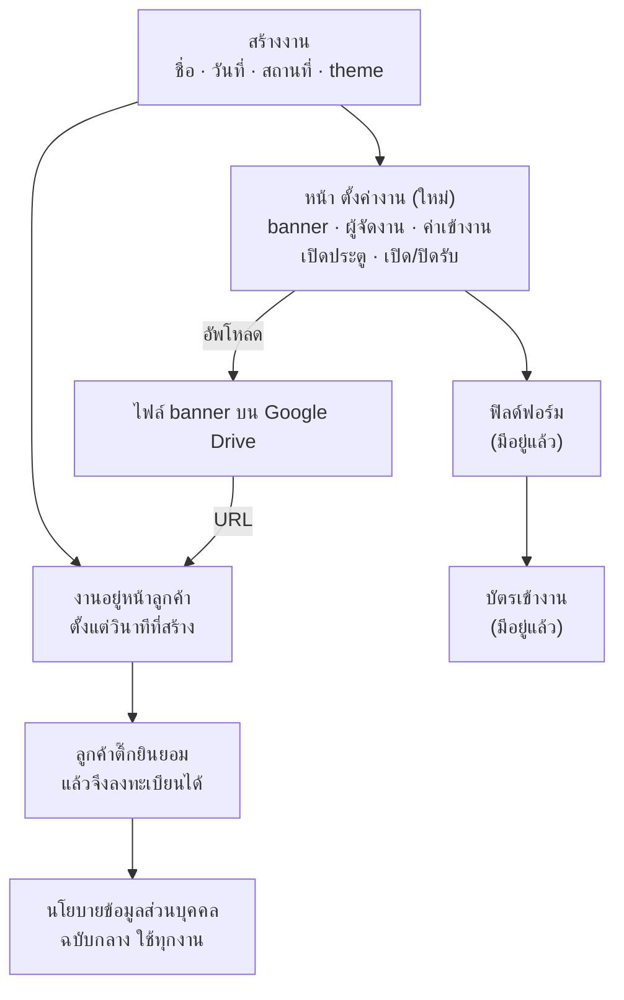
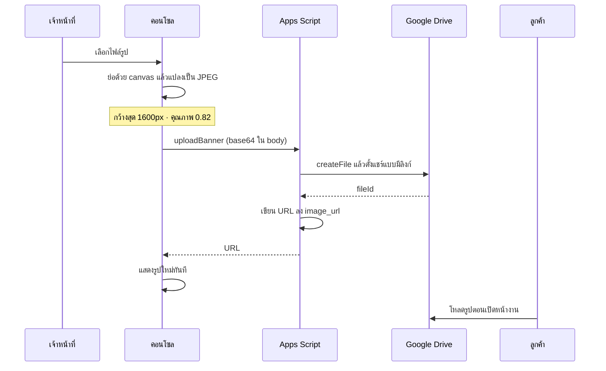
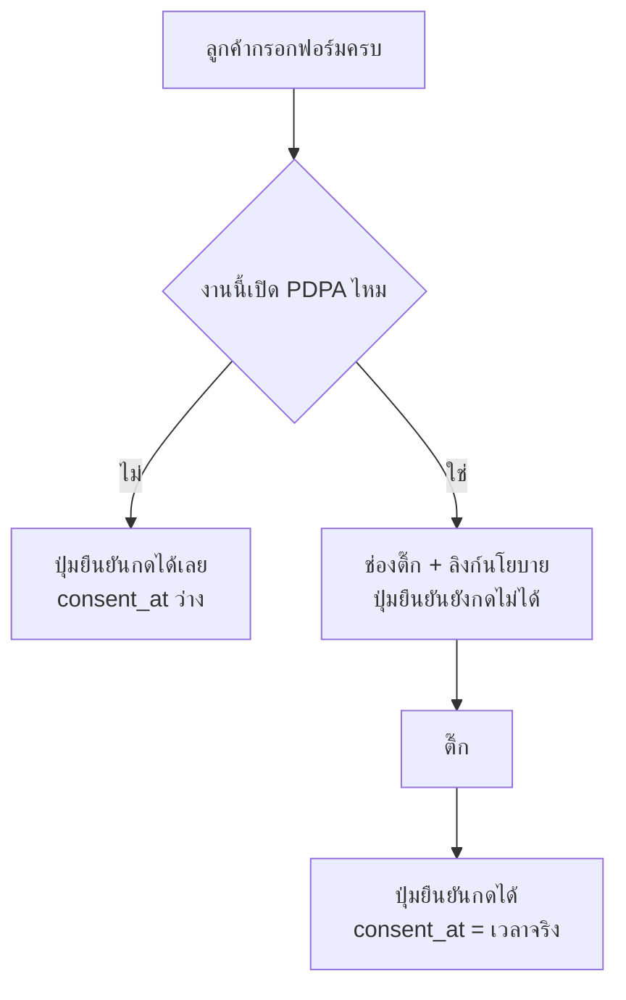

# Opening a new event, end to end, from the console

**Spec สำหรับ:** 1NEVE staff console (`~/dev/staff-console`) และเว็บลูกค้า
(`~/dev/events-checkin`) · **ไม่แตะ gate app**

**Mockup ที่ยืนยันแล้ว:**
https://claude.ai/code/artifact/4e9f0c16-8612-4262-b690-c70e489429af

---

## ปัญหา

1NEVE จะจัดอีกหลายงาน แต่การเปิดงานใหม่ยังทำจากคอนโซลไม่จบ

`svcSetEventProp_` รองรับ 9 ค่า — `theme` `open` `hidden` `pdpa` `doors`
`image` `name` `date` `place` — คอนโซลเรียกจริง 3 ค่า (`pdpa` `hidden`
`theme`) ที่เหลือไม่มีปุ่มไหนแตะ ผลคือ **สร้างงานแล้วแก้ชื่อหรือวันที่ไม่ได้
ปิดรับลงทะเบียนไม่ได้ และใส่ banner ไม่ได้เลย**

สาเหตุเชิงโครงสร้าง: `NAV` มี 6 หน้า ไม่มีหน้าไหนเป็นของ *ตัวงาน* ค่าที่เป็น
ของงานจึงกระจัดกระจาย — theme ไปอยู่หน้าบัตร PDPA ไปอยู่หน้าฟิลด์ ซ่อนงานไป
อยู่ที่ตัวเลือกงาน ที่เหลือไม่มีที่อยู่จึงไม่เคยถูกทำ

พร้อมกันนั้น การส่งข้อมูลผู้ลงทะเบียนให้ Organizer ยังไม่ถูกบอกกับใคร และปุ่ม
ลบข้อมูลไม่ได้ลบ

## การตัดสินใจ

บันทึกไว้ที่ `docs/adr/`

| ADR | เรื่อง |
|---|---|
| **0024** | งานที่ยังไม่มีรูปแสดงพื้นผิวแบรนด์ ไม่ใช่รูปหาย — แบบ C เลือกตอน render |
| **0025** | งานใหม่เปิดรับทันที ไม่มี wizard ไม่มีเช็คลิสต์ |
| **0026** | ราคาเป็นสวิตช์ ไม่ใช่ระบบการเงิน |
| **0027** | ยินยอมคือช่องติ๊กจริง และบังคับ |
| **0028** | นโยบายกลางฉบับเดียว · Organizer ระบบรู้แต่ลูกค้าไม่เห็น |
| **0029** | เก็บข้อมูลจนกว่าจะมีคนขอลบ |

ศัพท์ที่ตกลงกันแล้วอยู่ที่ `CONTEXT.md` — สำคัญที่สุดคือ **`org` = บริษัทของ
ผู้ลงทะเบียน** คนละเรื่องกับ **Organizer = ผู้จัดงานที่จ้าง 1NEVE** ห้ามย่อ
Organizer เป็น `org` ในโค้ดหรือใน copy

---

## หน้า "ตั้งค่างาน" — หน้าใหม่ในคอนโซล

เพิ่มเข้า `NAV` เป็นรายการถัดจาก ภาพรวมสด

| ช่อง | ชนิด | เขียนลงคอลัมน์ | ลูกค้าเห็นไหม |
|---|---|---|---|
| ชื่องาน | ข้อความ | `name` | เห็น |
| วันที่จัด | ข้อความอิสระ | `date_display` | เห็น |
| สถานที่ | ข้อความ | `place` | เห็น |
| **ชื่อผู้จัดงาน** | ข้อความ | `organizer_name` *(ใหม่)* | **ไม่เห็น** |
| **ผู้ติดต่อผู้จัดงาน** | ข้อความ | `organizer_contact` *(ใหม่)* | **ไม่เห็น** |
| **banner** | อัพโหลดไฟล์ | `image_url` | เห็น |
| **เปิดรับลงทะเบียน** | สวิตช์ | `open` | เห็น (ปุ่ม + ป้ายสถานะ) |
| **ค่าเข้างาน** | สวิตช์ + ข้อความ | `price_label` | เห็น (แถวข้อมูลงาน) |
| **เวลาเปิดประตู** | ข้อความอิสระ | `doors_at` | เห็นบนบัตร |

**PDPA อยู่ที่หน้าฟิลด์ฟอร์มเหมือนเดิม ไม่ย้าย** — มันอยู่ติดกับฟิลด์ที่มัน
ควบคุม และคำอธิบายที่นั่นเขียนไว้ดีแล้ว การย้ายเป็นความเสี่ยงที่ไม่ได้อะไร
กลับมา

**theme อยู่ที่หน้าบัตรเหมือนเดิม** — มันคุมสีบัตรเป็นหลัก

### สองคอลัมน์ใหม่ต้องเพิ่มแบบขี้เกียจ

`organizer_name` และ `organizer_contact` เกิดหลังชีตที่ใช้งานอยู่ ต้องใช้
รูปแบบเดียวกับที่ `pdpa` และ `doors_at` ใช้อยู่แล้วใน `svcSetEventProp_` —
เช็คว่ามีหัวคอลัมน์ไหม ถ้าไม่มีให้เขียนเพิ่มตอนบันทึกครั้งแรก **ไม่ใช่บังคับ
ให้ไปรัน `setupSheets()` ก่อน** ซึ่งจะทำให้ปุ่มดูเหมือนพัง

`image_url` ต้องได้การป้องกันแบบเดียวกันด้วย ปัจจุบันบรรทัด
`sh.getRange(i + 2, col.image_url)` เขียนโดยไม่เช็คว่าคอลัมน์มีอยู่ ถ้าไม่มี
มันจะโยน error ที่อ่านไม่รู้เรื่อง

---

## banner — ทางเดินของไฟล์

### ย่อรูปที่เบราว์เซอร์ก่อนเสมอ

ไฟล์จากมือถือหนัก 3–5 MB แปลง base64 แล้วโตอีกราวหนึ่งในสาม การส่งของขนาดนั้น
ผ่าน body ของ Apps Script เป็นการเสี่ยงโดยไม่จำเป็น และ **รูปใหญ่คือปัญหา
ความเร็วหน้าเว็บที่เคยบ่นไปแล้ว** — hero ใช้ `object-fit:cover` กับ
`transform:scale(1.35)` กว้าง 1600px เกินพอ

- รับเฉพาะ `image/jpeg` `image/png` `image/webp`
- ปฏิเสธไฟล์ต้นทางเกิน 12 MB ก่อนย่อ พร้อมบอกเหตุผลเป็นภาษาคน
- ย่อให้กว้างสุด 1600px รักษาอัตราส่วน แปลงเป็น JPEG คุณภาพ 0.82
- ปฏิเสธผลลัพธ์หลังย่อที่ยังเกิน 1.5 MB แปลว่ามีอะไรผิดปกติ
- ขนาดอ้างอิง: `gfest.jpg` ที่ใช้อยู่จริงหนัก 286 KB

### รูปแบบ URL ของ Drive — ต้องพิสูจน์เป็นงานแรกของแผน

ข้อกล่าวอ้างนี้ยังไม่ได้ทดสอบกับไฟล์จริง และทั้งฟีเจอร์พิงมันอยู่

1. `https://lh3.googleusercontent.com/d/<fileId>` — เสิร์ฟผ่าน CDN รองรับ
   ต่อท้ายขนาดเช่น `=w1600`
2. `https://drive.google.com/thumbnail?id=<fileId>&sz=w1600` — ตัวสำรอง

ทั้งสองต้องการให้ไฟล์ถูกตั้งเป็น `DriveApp.Access.ANYONE_WITH_LINK` กับ
`DriveApp.Permission.VIEW`

**ทางที่ไม่เอา:** ให้ Apps Script เสิร์ฟรูปเอง — มันมีพื้นเวลาต่อคำขอราว 2.5
วินาที ซึ่งวัดไว้แล้วในสเปคก่อนหน้า เอามาแขวนบน hero ไม่ได้

**ถ้าทั้งสองรูปแบบใช้ไม่ได้จริง ให้หยุดและรายงาน** อย่าเดินหน้าด้วยรูปแบบที่
เดาเอา ทั้งฟีเจอร์นี้ไม่มีความหมายถ้ารูปไม่ขึ้น

### เปลี่ยนรูปแล้วไฟล์เก่า

ลบไฟล์เก่าแบบพยายามอย่างดีที่สุด เมื่อ `image_url` เดิมตรงกับรูปแบบของเราเอง
และถอด `fileId` ออกมาได้ ล้มเหลวก็แค่ log ไว้ ไม่ทำให้การอัพโหลดพัง — ไฟล์
ค้างใน Drive ดีกว่าอัพโหลดไม่สำเร็จ

### สิทธิ์

`uploadBanner` ต้องผ่าน `requireStaff_(eventId, 'ADMIN')` เหมือน
`svcSetEventProp_` การสร้างไฟล์สาธารณะจากคำขอที่ไม่ได้ตรวจสิทธิ์ คือช่องให้
ใครก็ได้ยัดไฟล์ลง Drive ของเจ้าของสคริปต์

---

## พื้นผิวเริ่มต้น เมื่อยังไม่มี banner

`image_url` ว่าง แล้วฝั่งลูกค้าเลือกพื้นผิวแบรนด์ตอน render **ไม่เขียนค่าอะไร
ลงชีต** (ADR 0024)

แบบ **C — ไล่เฉดแบรนด์**: `linear-gradient(148deg, #d8482b 0%, #8e3524 34%,
#17150f 82%)` มีตัวอักษร `1N` ใหญ่จาง ๆ ที่ opacity ราว .085 เยื้องขวาบน และ
คำว่า `1NEVE` ตัวเล็กระยะห่างตัวอักษรกว้าง วางที่ **แถบกลาง**

**ข้อจำกัดที่ mockup เปิดเผย** — `.hero-media-scrim` ไล่จาก
`rgba(19,17,12,.88)` ที่ขอบล่างขึ้นไปโปร่งที่ขอบบน และ `.hero-topshade` ทำให้
ขอบบน 96px มืดสำหรับโลโก้ **แถบที่พื้นผิวได้โชว์จริงคือแถบกลางเท่านั้น** โลโก้
จึงอยู่ตรงนั้น ไม่ใช่มุมบนหรือกลางภาพ

ข้อจำกัดเดียวกันใช้กับรูปจริงที่ Organizer ส่งมา — ของสำคัญในรูปไม่ควรอยู่
ครึ่งล่าง เพราะชื่องานกับปุ่มทับหมด ควรบอกเขาตอนขอไฟล์

`.img-placeholder` และข้อความ `hint` (`วางรูปงานที่นี่` / `Drop the event
photo`) **ถูกลบทิ้งทั้งก้อน** ทั้งใน `styles.css` และในทั้งสองภาษาของ `app.js`
มันเชิญให้ลากไฟล์มาวางบนสิ่งที่รับไฟล์ไม่ได้มาตั้งแต่ต้น

---

## ค่าเข้างาน และป้ายสถานะ — สองที่ที่หน้าลูกค้าพูดไม่ตรง

### แถวข้อมูลงานวาดทุกแถว ไม่เช็คค่าว่าง

`app.js:227` สร้าง `pick-fact` สี่แถวเสมอ — วันที่ สถานที่ ที่นั่ง ค่าเข้างาน
ถ้าค่าว่างจะได้แถวที่มีหัวข้อแต่ไม่มีค่า **ดังนั้น "ปิดสวิตช์แล้วบรรทัดหาย"
ต้องแก้ที่ฝั่งลูกค้า ไม่ใช่แค่ลบค่าในชีต**

แก้เป็น: ข้ามแถวที่ค่าว่างหรือมีแต่ช่องว่าง ใช้กับทั้งสี่แถว — `seats_label`
ได้ประโยชน์เดียวกัน

สวิตช์ในคอนโซลจึงเขียน `price_label` เป็นข้อความที่พิมพ์เมื่อเปิด หรือสตริง
ว่างเมื่อปิด **ไม่ต้องเพิ่มคอลัมน์ใหม่**

### ป้ายสถานะยังเขียนว่าเปิดรับ ทั้งที่ปิดไปแล้ว

`app.js:230` เลือกสีป้ายจาก `e.open` แต่ `app.js:237` เอาตัวอักษรจาก
`e.status` ซึ่งคือ `status_label` ที่ `svcCreateEvent_` ฮาร์ดโค้ดไว้ว่า
`'เปิดรับ'` ตลอดกาล ปิดรับลงทะเบียนแล้วจะได้ **ป้ายสีเทาที่เขียนว่า เปิดรับ**

แก้เป็น: ตัวอักษรบนป้ายมาจากสถานะจริง — `open` เป็นจริงใช้ `status_label`
(ค่าเริ่มต้น `เปิดรับ`) `open` เป็นเท็จใช้ `ปิดรับแล้ว` เสมอ ไม่ว่า
`status_label` จะเขียนอะไรไว้

---

## ความยินยอม และหน้านโยบาย

### ช่องติ๊ก

> ☐ ยอมรับ **[นโยบายข้อมูลส่วนบุคคล]**

วงเล็บเหลี่ยมคือลิงก์ เปิดหน้านโยบายโดยไม่ทิ้งข้อมูลที่กรอกไว้ ปุ่ม
ยืนยันการลงทะเบียน อยู่ในสถานะกดไม่ได้จนกว่าจะติ๊ก

`consent: !!ev.pdpa` ที่ `app.js:726` เปลี่ยนเป็นสถานะจริงของช่องติ๊ก ผลข้าง
เคียง: `register()` กับ error `consent_required` **จะทำงานได้เป็นครั้งแรก**
ทุกวันนี้มันยิงไม่ได้เลย เพราะไคลเอนต์ส่ง `true` ทุกครั้งที่เซิร์ฟเวอร์จะ
เรียกร้อง

### หน้านโยบาย — ฉบับกลาง ใช้ทุกงาน

หน้าเดียวในเว็บลูกค้า ไม่มีเนื้อหาต่องาน ไม่ระบุชื่อ Organizer (ADR 0028)

| หัวข้อ | เนื้อหา |
|---|---|
| 1. ใครเป็นผู้ควบคุมข้อมูล | ผู้จัดงานของงานที่คุณลงทะเบียน เป็นผู้กำหนดว่าเก็บอะไรและใช้ทำอะไร · 1NEVE เป็นผู้ให้บริการระบบลงทะเบียนในนามของผู้จัดงาน · ต้องการทราบว่าใครเป็นผู้จัดงานของงานใด ติดต่อ 1NEVE |
| 2. เก็บอะไร | ชื่อ–นามสกุล อีเมล เบอร์โทรศัพท์ และฟิลด์เพิ่มเติมที่ผู้จัดงานกำหนด · เวลาที่ลงทะเบียน · เวลาและประตูที่เช็คอิน · จำนวนครั้งที่สแกน |
| 3. ใช้ทำอะไร | ออกบัตร QR · ยืนยันตัวตนหน้างาน · ส่งให้ผู้จัดงาน |
| 4. ใครได้รับ | ผู้จัดงาน ได้ทั้งชุด · Google ในฐานะผู้ให้บริการโครงสร้างพื้นฐานที่ข้อมูลถูกเก็บไว้ |
| 5. เก็บนานแค่ไหน | จนกว่าคุณหรือผู้จัดงานจะแจ้งให้ลบ ระบบไม่ลบตามกำหนดเวลาเอง |
| 6. สิทธิของคุณ | ขอดู ขอแก้ ขอลบ ขอถอนความยินยอม — ติดต่อ 1NEVE |
| 7. ติดต่อ | **ยังว่าง — ต้องเติมอีเมลหรือช่องทางของ 1NEVE** |

**ช่องว่างข้อ 7 ต้องได้คำตอบก่อนหน้านี้จะขึ้นจริง** นโยบายที่บอกให้ติดต่อ
โดยไม่บอกว่าติดต่อยังไง คือเอกสารที่ชี้ไปที่ความว่างเปล่า ซึ่งเป็นสิ่งเดียว
กับที่ ADR ชุดนี้มีไว้เพื่อกำจัด

ข้อความข้างต้นเป็น **ร่างที่เขียนจากสิ่งที่โค้ดทำจริง** ไม่ใช่คำแนะนำทาง
กฎหมาย ผู้รับผิดชอบเนื้อหาคือ 1NEVE

---

## ลบข้อมูลให้ลบจริง

ADR 0029 ประกาศว่า "เก็บจนกว่าจะมีคนขอลบ" ซึ่งซื่อสัตย์ได้ก็ต่อเมื่อการขอลบ
ได้ผลจริง วันนี้ยังไม่ได้ผล

**สองที่ที่ข้อมูลอยู่:**

| ที่ | ตาราง | ใครอ่าน |
|---|---|---|
| ไฟล์ของงาน | `Registrations` | คอนโซล · gate |
| ไฟล์ Overview | `AllRegistrations` | `getMyPass` — ค้น QR ด้วยเบอร์โทร |

**สิ่งที่ผิดอยู่:**

- `svcDeleteAttendee_` เขียน `status = 'deleted'` แล้วจบ ชื่อ อีเมล เบอร์ ยัง
  อยู่ในแถวครบทุกตัว
- มันไม่แตะ `AllRegistrations` เลย และ `getMyPass` กรอง
  `status !== 'deleted'` โดยอ่านจากตารางนั้น — **กรองคอลัมน์ที่ไม่มีใคร
  อัปเดต** ลบคนไปแล้วยังค้น QR ตัวเองเจอด้วยเบอร์โทร

**สิ่งที่ต้องเป็น:** การลบล้างคอลัมน์ที่เป็นข้อมูลส่วนบุคคลจริง — `full_name`
`email` `phone` `org` `answers_json` — ในทั้งสองที่ ภายใต้ล็อคเดียวกับที่
`register` ใช้ และคง `reg_id` `event_id` `status` `registered_at`
`checked_in_at` ไว้ เพื่อไม่ให้ยอดเช็คอินย้อนหลังเปลี่ยน

`badge_code` และ `qr_token` ต้องล้างด้วย ไม่งั้นบัตรใบเดิมยังผ่านประตูได้

---

## บั๊กที่ซ่อมไปพร้อมกัน

ทุกข้อยืนยันจากโค้ดแล้วระหว่างการซัก

| # | อาการ | ที่ |
|---|---|---|
| 1 | `svcCreateEvent_` เขียน 12 ค่าลงชีต 16 คอลัมน์ ทำให้ `hidden` `image_url` `pdpa` `doors_at` ว่างหมด | `Code.gs` |
| 2 | `pdpa` จึงเริ่มต้นเป็นปิด งานใหม่ไม่ขอความยินยอมเลย — **เปลี่ยนค่าเริ่มต้นเป็นเปิด** | `Code.gs` |
| 3 | `consent: !!ev.pdpa` ระบบติ๊กยินยอมแทนลูกค้า | `app.js:726` |
| 4 | `svcDeleteAttendee_` ขีดฆ่าอย่างเดียว | `Code.gs` |
| 5 | ปุ่มลบไม่แตะ `AllRegistrations` | `Code.gs` |
| 6 | `.img-placeholder` เขียนว่า "วางรูปงานที่นี่" ทั้งที่วางไม่ได้ | `styles.css` `app.js` |
| 7 | แก้ชื่อ วันที่ สถานที่ หลังสร้างไม่ได้ และปิดรับไม่ได้ | `staff.js` |
| 8 | `pick-fact` วาดแถวว่าง | `app.js:227` |
| 9 | ป้ายสถานะเขียน "เปิดรับ" ทั้งที่ปิดแล้ว | `app.js:237` |

---

## งานอยู่ที่ไหน

### `~/dev/staff-console/backend/Code.gs`

| ฟังก์ชัน | เปลี่ยนอะไร |
|---|---|
| `EVENTS_HEADERS` | เพิ่ม `organizer_name` `organizer_contact` |
| `svcCreateEvent_` | เขียนครบทุกคอลัมน์ · `pdpa` เริ่มต้นเป็นจริง |
| `svcSetEventProp_` | รับ `organizerName` `organizerContact` · เพิ่มคอลัมน์แบบขี้เกียจให้ทั้งสาม รวม `image_url` |
| `svcUploadBanner_` *(ใหม่)* | ตรวจสิทธิ์ ADMIN · สร้างไฟล์ Drive · ตั้งแชร์ · เขียน `image_url` · ลบไฟล์เก่าแบบพยายาม |
| `svcDeleteAttendee_` | ล้างคอลัมน์ส่วนบุคคลจริง ทั้งสองที่ ภายใต้ล็อค |
| `allEventsRows_` | **ห้ามส่ง `organizer_name` และ `organizer_contact` ออกไปกับ `listEvents`** ซึ่งเป็น endpoint สาธารณะ ให้ส่งเฉพาะใน `svcBootstrap_` ที่ผ่านการตรวจสิทธิ์ |
| `svc()` | ต่อ action `uploadBanner` |

### `~/dev/staff-console/staff/staff.js`

| จุด | เปลี่ยนอะไร |
|---|---|
| `NAV` | เพิ่มรายการ ตั้งค่างาน |
| `renderPage()` | เพิ่ม case ของหน้าใหม่ |
| `renderEvent()` *(ใหม่)* | ฟอร์มตามตารางข้างบน พร้อมตัวอัพโหลด banner และพรีวิว |
| `createEvent()` | คงเดิม แต่หลังสร้างพาไปหน้า ตั้งค่างาน แทนหน้าฟิลด์ |
| `act()` | ปุ่มใหม่ทั้งหมด |

### `~/dev/events-checkin/customer/`

| ไฟล์ | เปลี่ยนอะไร |
|---|---|
| `app.js` | พื้นผิวเริ่มต้นแทน `.img-placeholder` · ช่องติ๊กยินยอม · ลิงก์นโยบาย · ข้าม `pick-fact` ที่ว่าง · ป้ายสถานะตามความจริง · ลบข้อความ `hint` ทั้งสองภาษา |
| `styles.css` | คลาสพื้นผิวเริ่มต้น · ช่องติ๊ก · ปุ่มยืนยันสถานะกดไม่ได้ · ลบ `.img-placeholder` |
| `privacy.html` *(ใหม่)* | หน้านโยบาย ใช้ token เดียวกับหน้าอื่น |

**ไม่แตะ:** gate app ทั้งหมด · `badge.html` · ระบบ Team Access

---

## กฎที่ต้องเป็นจริง

- **Organizer ไม่หลุดออกหน้าลูกค้าเด็ดขาด** `listEvents` เป็น endpoint
  สาธารณะที่ไม่ต้องล็อกอิน ถ้าเผลอใส่สองฟิลด์นี้ลงไป การตัดสินใจทั้ง ADR 0028
  ก็ไร้ความหมาย
- **อัพโหลดต้องผ่านการตรวจสิทธิ์ ADMIN** ไม่งั้นใครก็ยัดไฟล์ลง Drive ของ
  เจ้าของสคริปต์ได้
- **ย่อรูปก่อนส่งเสมอ** ไม่มีเส้นทางไหนที่ไฟล์ดิบไปถึง Apps Script
- **`image_url` ว่างต้องแปลว่าว่างจริง** ห้ามเขียน URL ของพื้นผิวเริ่มต้นลง
  ชีต ไม่งั้นแยกไม่ออกว่า "ยังไม่ใส่รูป" กับ "เลือกรูปนี้"
- **ลบแล้วต้องลบทั้งสองที่** ไม่งั้นนโยบายที่เพิ่งเขียนกลายเป็นคำโกหกทันที
- **งานที่ปิดรับต้องดูเหมือนปิดรับ** ทั้งสีป้าย ตัวอักษรบนป้าย และปุ่ม
- **ช่องติ๊กต้องบังคับได้จริงทั้งสองฝั่ง** ไคลเอนต์กันปุ่ม เซิร์ฟเวอร์ยังตรวจ
  ซ้ำ — `consent_required` ต้องยิงได้ถ้ามีคนข้ามไคลเอนต์

---

## ข้อจำกัดที่รู้ตัว ไม่ใช่ช่องว่างที่ลืม

- **ไม่มีการลบข้อมูลอัตโนมัติตามเวลา** ต้องมีคอลัมน์วันที่ที่เครื่องอ่านได้
  ก่อน — `date_display` เป็นข้อความอิสระอย่าง `15 มี.ค. 70` และโปรเจกต์นี้ยัง
  ไม่มี trigger ตั้งเวลาสักตัว (ADR 0029)
- **ไม่มีทะเบียน Organizer** เก็บเป็นข้อความต่องาน ถ้าลูกค้ารายเดิมจ้างซ้ำ
  หลายงานต้องพิมพ์ใหม่ทุกครั้ง ยกเป็นทะเบียนทีหลังได้โดยของเดิมไม่พัง
- **การแชร์ไฟล์ชีตให้ Organizer ยังทำมือ** ไม่มีอะไรในสเปคนี้แตะสิทธิ์ Drive
  ของไฟล์งาน
- **สัญญากับ Organizer อยู่นอกสเปคนี้** สิ่งที่จัดสรรความรับผิดระหว่างผู้
  ควบคุมข้อมูลกับผู้ประมวลผล คือข้อตกลงเป็นลายลักษณ์อักษรที่ต้องมีทนายไทย
  ประกาศบนหน้าเว็บไม่ได้ทำหน้าที่นั้น
- **ไฟล์ banner เก่าอาจค้างใน Drive** ถ้าถอด `fileId` จาก URL เดิมไม่ได้
- **ความปลอดภัยยังมีหนี้ค้าง** `createLoadTestAccount` และ
  `removeLoadTestAccount` ใน `Code.gs` มีรหัสผ่านเป็น plaintext อยู่ใน version
  control ความปลอดภัยของระบบเป็นหน้าที่ของผู้ประมวลผลที่ปัดให้ใครไม่ได้ ควรลบ
  เมื่อ account ทดสอบถูกลบแล้ว — นอกสเปคนี้ แต่ไม่ควรลืม

---

## แผนการตรวจสอบ

1. **พิสูจน์ URL ของ Drive ก่อนอย่างอื่น** อัพโหลดไฟล์จริงหนึ่งใบผ่าน Apps
   Script ตั้งแชร์ แล้วเปิดทั้งสองรูปแบบจากเบราว์เซอร์ที่ **ไม่ได้ล็อกอิน
   Google** ถ้าไม่ผ่านทั้งคู่ ให้หยุดและรายงาน
2. `node --check` ทั้ง `staff.js` `app.js` และ `Code.gs` ที่คัดลอกเป็น `.js`
3. สร้างงานใหม่จากคอนโซล แล้วเปิดชีตดูว่า **ทั้ง 16 คอลัมน์ถูกเขียน** และ
   `pdpa` เป็นจริง
4. งานใหม่นั้นเปิดหน้าลูกค้าทันที เห็นพื้นผิวแบบ C พร้อมชื่องานทับอ่านออก
5. อัพโหลด banner จากคอนโซล รูปขึ้นในพรีวิวทันที เปิดหน้าลูกค้าใหม่รูปขึ้นจริง
   และไฟล์ที่ส่งขึ้นไป **เล็กกว่า 1.5 MB**
6. เปลี่ยน banner อีกครั้ง ยืนยันว่าไฟล์เก่าถูกลบหรือถูก log ไว้
7. ปิดสวิตช์ ค่าเข้างาน — บรรทัดนั้นหายจากหน้าลูกค้า ไม่ใช่เหลือหัวข้อเปล่า
8. ปิดสวิตช์ เปิดรับลงทะเบียน — ป้ายเป็นสีเทา **และเขียนว่า ปิดรับแล้ว** ปุ่ม
   ลงทะเบียนกดไม่ได้ และ `register()` ตอบ `event_closed` ถ้ายิงตรง
9. กรอกฟอร์มจนครบโดยไม่ติ๊ก — ปุ่มยืนยันกดไม่ได้ · ติ๊กแล้วกดได้ · เปิดชีตดู
   `consent_at` มีเวลาจริง
10. ยิง `register` ตรงโดยส่ง `consent: false` กับงานที่เปิด PDPA ต้องได้
    `consent_required`
11. กรอก `organizer_name` แล้วเรียก `listEvents` แบบไม่ล็อกอิน — **ต้องไม่มี
    ฟิลด์นั้นใน response**
12. ลบผู้ลงทะเบียนหนึ่งคน แล้ว **ค้น QR ด้วยเบอร์โทรของคนนั้น** ต้องได้
    `not_found` และเปิดทั้งสองชีตดูว่าคอลัมน์ส่วนบุคคลว่างจริง
13. เปิดหน้านโยบายจากลิงก์ในช่องติ๊ก แล้วกดกลับ ข้อมูลที่กรอกไว้ยังอยู่ครบ
14. หน้าลูกค้าที่ความกว้าง 390px — พื้นผิว ช่องติ๊ก และหน้านโยบายอ่านได้ทั้งหมด
